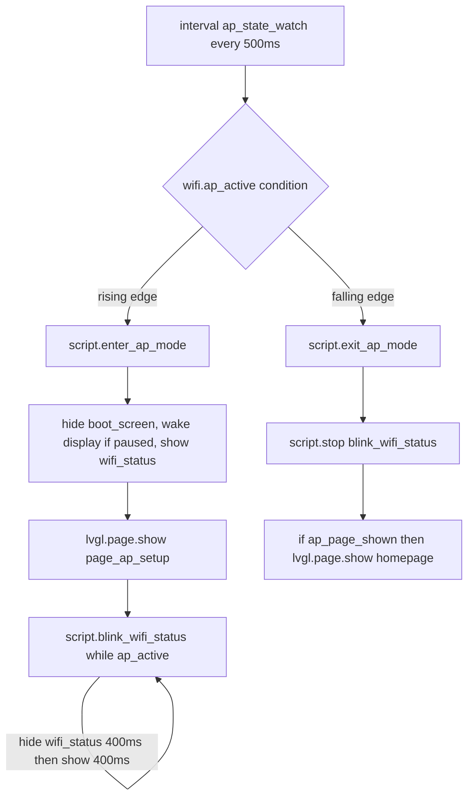
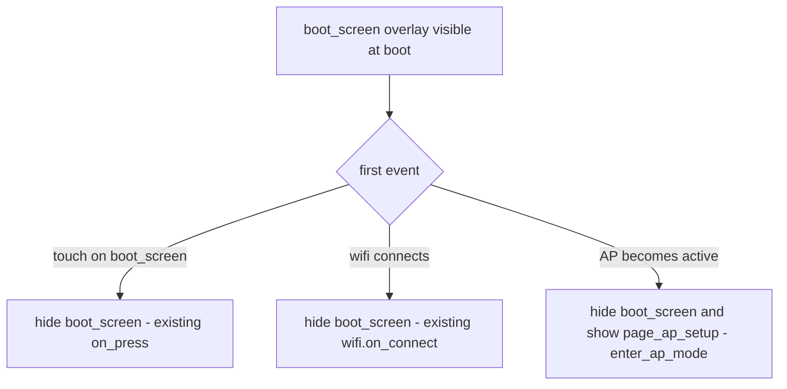

# Plan: AP mode page (WiFi setup) + boot screen dismissal logic

**Status:** Proposed
**Scope:** Software-only UI/state changes. No hardware, font-file, or HA-side changes.
**TODO items covered:** [`TODO.md`](../TODO.md:18) (AP-mode page + blinking `wifi_status`) and [`TODO.md`](../TODO.md:19) (boot screen up until WiFi connect / touch / AP active).

---

## Goal

1. **Improvement 1** — When the device enters fallback AP mode with captive portal (`is_ap_active`), display a dedicated **WiFi setup page** (`page_ap_setup`) showing the AP SSID, password, and instructions; auto-return to the normal flow (Now Playing) when AP mode ends; and make the top-layer `wifi_status` indicator **blink** the `wifi_100` glyph while AP is active.
2. **Improvement 2** — Keep the boot screen visible until the **first** of: user touches it, WiFi connects, or AP mode becomes active; wire the AP-active case into the existing boot-screen dismissal.

---

## Findings (answers to investigation questions)

### 1. How pages are declared and switched

- Pages live under `lvgl: pages:` as a list. There is currently exactly **one** page: `page_now_playing`, declared in [`packages/esp-web-radio-page_now_playing.yaml`](../packages/esp-web-radio-page_now_playing.yaml:21).
- The LVGL framework block lives in [`packages/esp-web-radio-lvgl_ui.yaml`](../packages/esp-web-radio-lvgl_ui.yaml:112) and declares `bottom_layer`, `top_layer`, `page_wrap: true`, plus the top-layer widgets.
- Switching actions used today:
  - `lvgl.page.show: page_now_playing` — [`esp-web-radio.yaml`](../esp-web-radio.yaml:17) `esphome.on_boot`; also the bottom-nav **home** button uses `lvgl.page.show: ${homepage}` ([`esp-web-radio-lvgl_ui.yaml`](../packages/esp-web-radio-lvgl_ui.yaml:254)) where `homepage` is the substitution `page_now_playing` ([`esp-web-radio-lvgl_ui.yaml`](../packages/esp-web-radio-lvgl_ui.yaml:15)).
  - `lvgl.page.next` / `lvgl.page.previous` — swipe handlers on `top_layer` ([`esp-web-radio-lvgl_ui.yaml`](../packages/esp-web-radio-lvgl_ui.yaml:136)) and the prev/next `buttonmatrix` buttons ([`esp-web-radio-lvgl_ui.yaml`](../packages/esp-web-radio-lvgl_ui.yaml:245)).
- **No page-level events (`on_show`/`on_hide`) are used anywhere.** Per current ESPHome LVGL docs, each page additionally supports `skip: true`, which excludes it from `lvgl.page.next/previous` navigation — this is the key mechanism we use so the new AP page is **not** reachable by swiping or by the prev/next nav buttons.

### 2. Where the boot screen is

- The "boot screen" is **not an LVGL page** — it is a full-screen `obj` named `boot_screen` inside `top_layer` ([`packages/esp-web-radio-lvgl_ui.yaml`](../packages/esp-web-radio-lvgl_ui.yaml:151)), drawn above all pages. It shows a surface-colored `COVER` background with a centered `spinner` (1 s spin time, accent arc).
- It is visible by default (no `hidden: true`) and is dismissed by exactly two paths today:
  1. its own `on_press` (touch anywhere on it) → `lvgl.widget.hide: boot_screen` ([`packages/esp-web-radio-lvgl_ui.yaml`](../packages/esp-web-radio-lvgl_ui.yaml:173));
  2. `wifi.on_connect` → `lvgl.widget.hide: boot_screen` ([`packages/esp-web-radio-lvgl_ui.yaml`](../packages/esp-web-radio-lvgl_ui.yaml:72)).
- Relationship to Now Playing: `on_boot` immediately shows `page_now_playing` underneath ([`esp-web-radio.yaml`](../esp-web-radio.yaml:17)); the `boot_screen` overlay covers it until one of the two dismissals above. So today's UX is already "now-playing page + spinner overlay".

**Gap for Improvement 2:** there is **no** dismissal path for "AP with captive portal comes up" — that is what we add (the AP page show itself will hide `boot_screen`).

### 3. How wifi / captive portal / AP state is exposed

- `captive_portal:` is enabled in [`esp-web-radio.yaml`](../esp-web-radio.yaml:77). **It exposes no automation triggers** — current ESPHome docs list only a `compression` option. There is no `on_start`/`on_end` on captive portal.
- The fallback AP is configured inline in the `wifi:` block ([`esp-web-radio.yaml`](../esp-web-radio.yaml:73)): ssid `"ESP Radio Fallback"`, password `!secret ap_password`. The AP is only enabled after `ap_timeout` (default **90 s** per WiFi docs; captive portal docs say ~1 min) of failed station-connection attempts. No `ap_timeout` is set today.
- **`is_ap_active` exists as a native ESPHome feature of the WiFi component** (confirmed in the official docs):
  - condition: `wifi.ap_active`
  - lambda equivalent: `id(<wifi_id>).is_ap_active()` (works without explicitly naming an id because the schema finds the singleton wifi component; adding `id:` to `wifi:` is optional and only needed for the lambda form).
- `wifi_status` widget: top-layer label id `wifi_status` ([`packages/esp-web-radio-lvgl_ui.yaml`](../packages/esp-web-radio-lvgl_ui.yaml:215)), text `${wifi_100}`, font `menu24`, `hidden: true` by default. It is currently a pure state indicator — shown on `wifi.on_connect`, hidden on `wifi.on_disconnect` ([`packages/esp-web-radio-lvgl_ui.yaml`](../packages/esp-web-radio-lvgl_ui.yaml:69)). It is **not** bound to any sensor (the `wifi_signal` RSSI sensor is commented out in [`packages/esp-web-radio-homeassistant.yaml`](../packages/esp-web-radio-homeassistant.yaml:188)).

### 4. Fonts / `wifi_100` glyph

- `wifi_100` = `\U000F0928` (**mdi-wifi-strength-4**) — defined as a substitution in [`packages/display-fonts.yaml`](../packages/display-fonts.yaml:11) and embedded in the `menu24` font extras glyph list ([`packages/display-fonts.yaml`](../packages/display-fonts.yaml:42)). The `wifi_status` label already renders it, so **no font change is needed** for the status indicator or for a 24 px icon on the AP page. (Optional: a larger 48 px MDI icon font can be added for the AP page hero icon — see Change 1.)
- Glyph references in labels use either the substitution (`${wifi_100}`) or the raw escape (`"\U000F0928"`).
- **Cross-package substitutions work in this project**: `page_now_playing.yaml` already uses `${font_icon}`, `${color_panel}`, `${text_play}` etc. defined in other packages — so the new package may freely reference `${wifi_100}`, `${color_*}`, `${font_*}` and any new `ap_ssid` substitution defined in the main file.

---

## Design overview

A small AP state machine driven by polling `wifi.ap_active`, mirroring the existing `update_clock` script pattern (single source of truth, idempotent scripts):



Boot-screen dismissal priority (all three fire independently; the first event wins for the boot screen, while the AP page is driven solely by `ap_active`):



Why poll instead of event hooks: `captive_portal` has no triggers (verified against docs), and `wifi.on_connect`/`on_disconnect` only fire for the *station* interface. Polling `wifi.ap_active` on a 500 ms `interval` gives both rising- and falling-edge detection with two `globals` carrying state, which is deterministic and version-robust.

---

## Changes

### Change 1 — NEW file `packages/esp-web-radio-page_ap_setup.yaml`

New package containing the AP setup page. Follow the `page_now_playing` port conventions: shared styles from [`packages/lvgl_theme.yaml`](../packages/lvgl_theme.yaml:125), theme substitutions, no raw hex colors, `scrollbar_mode: "OFF"`.

Key decisions:
- Page id **`page_ap_setup`** with **`skip: true`** so swipes and the prev/next nav buttons cannot land on it.
- Full-screen `card`-style container (like `mp_card`) so the bottom layer does not peek through.
- Static content only (no sensors bound): title, `wifi_100` hero icon, two-step instruction text, an info panel with **SSID / password / URL** rows, and a bottom hint. Label ids (namespace must stay unique project-wide): `ap_lbl_title`, `ap_lbl_icon`, `ap_lbl_step1`, `ap_lbl_step2`, `ap_lbl_ssid`, `ap_lbl_password`, `ap_lbl_url`, `ap_lbl_hint`.
- No `on_press`/gesture handlers on the page: while AP is active the page is effectively **locked** (see guards in Change 3); it clears automatically when AP mode ends.

```yaml
# ==============================================================================
# page_ap_setup.yaml - AP mode / WiFi setup page (landscape 480x320)
#
# Shown by `script.enter_ap_mode` when the fallback AP + captive portal become
# active (`wifi.ap_active`). `skip: true` keeps it out of swipe/prev-next
# navigation. Uses theme styles/substitutions from lvgl_theme.yaml and the
# wifi_100 substitution from display-fonts.yaml (cross-package substitutions
# are already used elsewhere in this project).
# ==============================================================================

lvgl:
  pages:
    - id: page_ap_setup
      skip: true                 # NOT reachable via lvgl.page.next/previous
      scrollbar_mode: "OFF"
      widgets:
        - obj:
            id: ap_card
            styles: card
            x: 0
            y: 0
            width: 480
            height: 320
            pad_all: 0
            scrollbar_mode: "OFF"
            widgets:
              - label:
                  id: ap_lbl_title
                  styles: text_title
                  align: TOP_MID
                  y: 26
                  width: 100%
                  text: "WiFi Setup Required"
                  text_align: CENTER
              - label:
                  id: ap_lbl_icon
                  align: TOP_MID
                  y: 62
                  text: "${wifi_100}"        # mdi-wifi-strength-4, menu24 font
                  text_font: ${font_icon}
                  text_color: ${color_accent}
              - label:
                  id: ap_lbl_step1
                  styles: text_body
                  align: TOP_MID
                  y: 104
                  width: 100%
                  text: "No WiFi connection. The device started its own"
                  text_align: CENTER
                  long_mode: WRAP
              - label:
                  id: ap_lbl_step2
                  styles: text_muted
                  align: TOP_MID
                  y: 126
                  width: 100%
                  text: "access point. Connect to the network below."
                  text_align: CENTER
                  long_mode: WRAP
              - obj:
                  id: ap_info_panel
                  styles: panel
                  x: 60
                  y: 158
                  width: 360
                  height: 96
                  pad_all: 0
                  scrollbar_mode: "OFF"
                  widgets:
                    - label:
                        id: ap_lbl_ssid
                        styles: text_body
                        x: 16
                        y: 6
                        width: 330
                        text: "Network:  ${ap_ssid}"
                        text_align: LEFT
                        long_mode: CLIP
                    - label:
                        id: ap_lbl_password
                        styles: text_muted
                        x: 16
                        y: 34
                        width: 330
                        text: "Password: ${ap_password_display}"
                        text_align: LEFT
                        long_mode: CLIP
                    - label:
                        id: ap_lbl_url
                        styles: text_small
                        x: 16
                        y: 62
                        width: 330
                        text: "Open http://192.168.4.1 to finish the setup"
                        text_align: LEFT
                        long_mode: CLIP
              - label:
                  id: ap_lbl_hint
                  styles: text_small
                  align: BOTTOM_MID
                  y: -22
                  text: "The page closes automatically when WiFi reconnects."
```

Notes for the implementer:
- Strings may be localized (the project mixes English and Russian UI text; OTA popup is Russian). Keep them consistent in the chosen language.
- `ap_password_display`: leave empty to hide the password row, or set it to the same value as the `ap_password` secret so it is shown (see Risks — this displays a secret on screen). If you prefer to bind it directly, `text: !secret ap_password` also expands at config time, but an explicit substitution is easier to keep visible/invisible.
- Optional polish: add a larger hero icon by declaring a new `mdi48` font (size 48, `bpp: 4`, `file: fonts/materialdesignicons-webfont.ttf`, `glyphs: ["\U000F0928"]`) and switching `ap_lbl_icon` to it. Not required.

### Change 2 — `esp-web-radio.yaml`

1. Add a `substitutions:` block (new top-level key) with the AP identity, and use it in `wifi.ap.ssid` so SSID and label can never drift:

```yaml
substitutions:
  ap_ssid: "ESP Radio Fallback"   # keep in sync with wifi.ap.ssid below
```

```yaml
wifi:
  ssid: !secret wifi_ssid
  password: !secret wifi_password
  # Fallback access point (captive portal) when WiFi is unavailable
  ap:
    ssid: "${ap_ssid}"
    password: !secret ap_password
```

2. Include the new package in `packages:` (after `page_now_playing`):

```yaml
  page_ap_setup: !include packages/esp-web-radio-page_ap_setup.yaml
```

3. Optional: shorten the wait before the AP page appears by lowering `ap_timeout` under `wifi.ap` (e.g. `ap_timeout: 20s`). Default is 90 s; this only changes how long the boot spinner shows before the AP page. If unsure, keep the default.

### Change 3 — `packages/esp-web-radio-lvgl_ui.yaml`

This is the core wiring. Keep `globals`/`script`/`interval` as new entries in the existing file-level blocks (they merge across files like `globals` does today).

1. **Globals** (extend the existing `globals:` block at [`packages/esp-web-radio-lvgl_ui.yaml`](../packages/esp-web-radio-lvgl_ui.yaml:19)):

```yaml
  # True while the fallback AP + captive portal are active (mirrors
  # `wifi.ap_active`; edges detected by `interval.ap_state_watch`).
  - id: ap_active
    type: bool
    restore_value: no
    initial_value: "false"
  # True while page_ap_setup is displayed; used to decide whether
  # `exit_ap_mode` must return to the home page.
  - id: ap_page_shown
    type: bool
    restore_value: no
    initial_value: "false"
```

2. **Scripts** (extend the existing `script:` block at [`packages/esp-web-radio-lvgl_ui.yaml`](../packages/esp-web-radio-lvgl_ui.yaml:25)):

```yaml
  - id: enter_ap_mode
    then:
      - logger.log: "AP mode: showing WiFi setup page"
      # Wake the display in case the device idled/slept while STA was failing
      - if:
          condition: lvgl.is_paused
          then:
            - lvgl.resume:
            - lvgl.widget.redraw:
            - light.turn_on: backlight
      - lvgl.widget.hide: boot_screen     # Improvement 2: AP dismisses boot
      - lvgl.page.show: page_ap_setup
      - lambda: 'id(ap_page_shown) = true;'
      - lvgl.widget.show: wifi_status
      - script.execute: blink_wifi_status

  - id: exit_ap_mode
    then:
      - logger.log: "AP mode ended"
      - script.stop: blink_wifi_status
      - if:
          condition:
            lambda: 'return id(ap_page_shown);'
          then:
            - lvgl.page.show: ${homepage}   # back to Now Playing
            - lambda: 'id(ap_page_shown) = false;'
      # wifi_status visibility is now governed again by wifi.on_connect/
      # on_disconnect (station up => shown, down => hidden).

  - id: blink_wifi_status
    mode: restart
    then:
      - while:
          condition:
            lambda: 'return id(ap_active);'
          then:
            - lvgl.widget.hide: wifi_status
            - delay: 400ms
            - lvgl.widget.show: wifi_status
            - delay: 400ms
```

3. **Interval** (new top-level key in this package; none exists yet anywhere in the project):

```yaml
interval:
  - id: ap_state_watch
    interval: 500ms
    then:
      - if:
          condition: wifi.ap_active
          then:
            - if:
                condition:
                  lambda: 'return !id(ap_active);'
                then:                      # rising edge: AP just became active
                  - lambda: 'id(ap_active) = true;'
                  - script.execute: enter_ap_mode
          else:
            - if:
                condition:
                  lambda: 'return id(ap_active);'
                then:                      # falling edge: AP just ended
                  - lambda: 'id(ap_active) = false;'
                  - script.execute: exit_ap_mode
```

4. **Navigation guards** — while AP is active the setup page must behave as a locked modal:
   - Wrap the two `top_layer` swipe handlers ([`packages/esp-web-radio-lvgl_ui.yaml`](../packages/esp-web-radio-lvgl_ui.yaml:136)) in `if: condition: wifi.ap_active ... else:` style guards, i.e. perform the `lv_indev_wait_release` + `lvgl.page.next/previous` only when `wifi.ap_active` is **false**:

```yaml
    on_swipe_left:
      - if:
          condition:
            not:
              - wifi.ap_active
          then:
            - lambda: 'lv_indev_wait_release(lv_indev_get_act());'
            - lvgl.page.next:
                animation: OUT_LEFT
                time: 300ms
    on_swipe_right:
      - if:
          condition:
            not:
              - wifi.ap_active
          then:
            - lambda: 'lv_indev_wait_release(lv_indev_get_act());'
            - lvgl.page.previous:
                animation: OUT_RIGHT
                time: 300ms
```

   - Guard the three `buttonmatrix` buttons (`page_prev`, `page_home`, `page_next` at [`packages/esp-web-radio-lvgl_ui.yaml`](../packages/esp-web-radio-lvgl_ui.yaml:244)) the same way (`wifi.ap_active` false → run the action). This is essential for the **home** button (`lvgl.page.show: ${homepage}`), which would otherwise escape the locked AP page.
   - Optional polish: additionally `lvgl.widget.hide: top_layer` in `enter_ap_mode` and `lvgl.widget.show: top_layer` in `exit_ap_mode` to hide the bottom nav bar entirely during AP mode. (Note: the `buttonmatrix` id is confusingly named `top_layer`; it is a widget id, so `lvgl.widget.hide: top_layer` targets the nav bar only — the status labels in the layer are separate widgets and stay visible.)

5. **Hardening in `wifi.on_connect`** — the station can reconnect at almost the same moment the AP ends; make the return-to-home path race-proof ([`packages/esp-web-radio-lvgl_ui.yaml`](../packages/esp-web-radio-lvgl_ui.yaml:69)):

```yaml
wifi:
  on_connect:
    - logger.log: "WiFi connected"
    - lvgl.widget.hide: boot_screen
    - lvgl.widget.show: wifi_status
    - lambda: 'id(wifi_connected) = true;'
    - script.execute: update_clock
    # Safety net: if we reconnect while the AP setup page is still up,
    # return to Now Playing immediately (the interval normally handles this).
    - if:
        condition:
          lambda: 'return id(ap_page_shown);'
        then:
          - script.stop: blink_wifi_status
          - lvgl.page.show: ${homepage}
          - lambda: 'id(ap_page_shown) = false;'
```

(`wifi.on_disconnect` is left untouched: it hides `wifi_status`, but `enter_ap_mode` re-shows it and the blink loop self-heals within one blink cycle if `on_disconnect` fires mid-AP.)

### Change 4 — `tests/yaml_syntax_check.py`

Add the new package to the `files` list so the pure-YAML syntax check covers it ([`tests/yaml_syntax_check.py`](../tests/yaml_syntax_check.py:10)):

```python
    'packages/esp-web-radio-page_ap_setup.yaml',
```

### Change 5 — `TODO.md`

After implementation, mark both items complete and note the mechanism, matching how the previous improvement updated `TODO.md`:

```
- [x] AP mode page (page_ap_setup, wifi.ap_active polling, wifi_status blink)
- [x] Boot screen until WiFi connect / touch / AP active
```

---

## Behavior verification matrix

| Scenario | Expected behavior |
|---|---|
| Normal boot, router reachable | Spinner `boot_screen` up until `wifi.on_connect`, then hidden; Now Playing visible; `wifi_status` steady |
| Boot, no router; AP not yet up (< `ap_timeout`) | Spinner stays up (existing behavior; default wait 90 s) |
| `ap_timeout` elapses, AP starts | Rising edge of `wifi.ap_active` → `enter_ap_mode`: boot screen hidden, `page_ap_setup` shown, `wifi_status` blinking `wifi_100` at ~400 ms cadence, display wakes if it was idle-sleeping |
| User touches boot screen before anything else | `boot_screen` hides immediately (existing `on_press`); if AP later becomes active, the AP page still appears |
| User swipes / presses prev-next-home while AP page shown | No navigation happens (guards + `skip: true`); page stays locked |
| User connects phone to AP and completes captive portal setup; device saves creds and reboots | Reboot → new WiFi connects → normal boot flow (boot spinner → Now Playing) |
| Router comes back, STA reconnects while AP page shown | Falling edge of `wifi.ap_active` → `exit_ap_mode`: blink stops, returns to `${homepage}`; `wifi.on_connect` keeps `wifi_status` visible (steady) and the clock resumes |
| AP page shown, device goes idle | `on_idle` still runs after 15 s (backlight off, snow); next AP-state transition or touch wakes it via `enter_ap_mode`'s resume branch |

---

## Validation

1. Run the YAML syntax helper (must pass, including the new file): `python tests/yaml_syntax_check.py`
2. With local secrets available, run the full config resolution: `esphome config esp-web-radio.yaml --secrets secrets_radio.yaml` — confirms the merged config resolves `wifi.ap.ssid` substitution, the new `pages` entry, the `interval`/`script`/`globals` cross-references, and the `wifi.ap_active` condition.
3. Flash and exercise the matrix above (a convenient way to trigger AP mode: power on with the router off; then turn the router back on to test automatic return).
4. Confirm `wifi.ap_active` condition parses on the installed ESPHome version (it is documented in current WiFi component docs; if the installed version predates it, fall back to `wifi: id: wifi_network` + lambda `id(wifi_network).is_ap_active()` in the guards and interval — same semantics).

---

## Risks / notes

- **No `captive_portal` triggers exist** — do not attempt `captive_portal.on_start/on_end`; use the `wifi.ap_active` polling design above.
- **AP start latency**: the fallback AP (and therefore the AP page) only appears after `ap_timeout` (default 90 s) of failed connection attempts. Acceptable as-is; optionally lower `ap_timeout` (e.g. 20 s) — note this shortens the window where the boot spinner shows before the AP page.
- **`wifi.on_disconnect` hides `wifi_status`** while AP is active in rare orderings; `enter_ap_mode` shows it and the blink loop re-shows it each cycle, so the indicator self-heals.
- **Page-switch during AP**: use plain `lvgl.page.show` (no `animation`/`time`) for `page_ap_setup` to avoid transition artifacts over the top-layer chrome.
- **Adding a page makes it swipe-reachable** — mitigated with `skip: true` on `page_ap_setup` plus the guarded swipe/button handlers. Without these, swiping from Now Playing would land on the AP page and users could get stuck or navigate behind it.
- **Timing of `is_ap_active`**: it reflects the hardware AP state; the 500 ms interval adds at most ~0.5 s of UI reaction delay, which is imperceptible for this use case.
- **Blink script** uses cooperative delays (`while` + `delay`), which yield to the scheduler; `mode: restart` prevents stacked instances, and `script.stop` on exit makes the stop immediate. Do not raise the delay above ~1 s or the blink looks sluggish.
- **Password on screen**: showing `ap_password` (a secret) on a public-facing display is a deliberate product choice from the TODO; keep `ap_password_display` empty unless required, and remember it must be mirrored in firmware.
- **Substitutions across packages** work here (proven by existing usage in `page_now_playing.yaml`); if a future ESPHome version regresses that, duplicate `ap_ssid`/`wifi_100` definitions into `page_ap_setup.yaml` and drop the main-file substitution.
- **Do not redeclare `lvgl.theme`/`style_definitions`** anywhere (project convention, duplicate-key merge error) — the new page only references existing styles.

---

## Implementation amendment (2026-09-28) — always-on interval instead of `interval.start`/`interval.stop`

The originally planned mechanism started/stopped the `ap_state_watch` interval from
`wifi.on_disconnect` / `wifi.on_connect` using `interval.start` / `interval.stop`.
**Those two actions do not exist in ESPHome**: the `interval` component registers no
actions at all — verified against the official Interval docs (no Actions section) and the
current [`esphome/components/interval/__init__.py`](https://raw.githubusercontent.com/esphome/esphome/dev/esphome/components/interval/__init__.py)
source. An actual `esphome config` run rejects them with "Unable to find action with the
name 'interval.start'/'interval.stop'". The shipped code therefore uses **Option A**: an
*always-on* interval whose body is guarded by `!id(wifi_connected)`, so each 500 ms tick
is a no-op while the station is connected (see the interval block at
[`packages/esp-web-radio-lvgl_ui.yaml`](../packages/esp-web-radio-lvgl_ui.yaml:190)).

Why the always-on form is also the safer design for the *primary* scenario (router-less boot):

- `wifi.on_disconnect` is edge-triggered on `is_connected() != handled_connected_state_`
  ([`WiFiComponent::loop()`](https://raw.githubusercontent.com/esphome/esphome/dev/esphome/components/wifi/wifi_component.cpp),
  with both `connected_` and `handled_connected_state_` initialized to `false` in
  `wifi_component.h`) — so it **never fires when the device simply fails to connect at
  boot**. A start/stop-gated poll would never launch, and the AP page would never appear.
- An always-on interval ticks from startup, so the boot → `ap_timeout` (20 s) → fallback
  AP rising edge is observed with zero additional wiring.

Notes on the shipped behavior:

- Reconnect while the AP page is up is handled by the `wifi.on_connect` safety net
  (return to `${homepage}`, restore nav bar, stop blink); the dormant interval cannot
  observe the AP's falling edge in that case, so the `ap_active` global may stay `true`
  until the next disconnect — harmless, and it self-heals on the first tick of the next
  offline period (a spurious "AP mode ended" log only).
- `wifi.ap_active` condition is confirmed present in the current WiFi component
  (`automation.register_bare_condition("wifi.ap_active", ...)`); lambda equivalent
  `id(wifi).is_ap_active()` works without declaring an id because `wifi` is the component's
  default id.
- The rest of this plan (new page package, scripts, nav guards, boot-screen dismissal,
  substitutions, validation) shipped as specified; `python tests/yaml_syntax_check.py`
  passes for all 8 files.