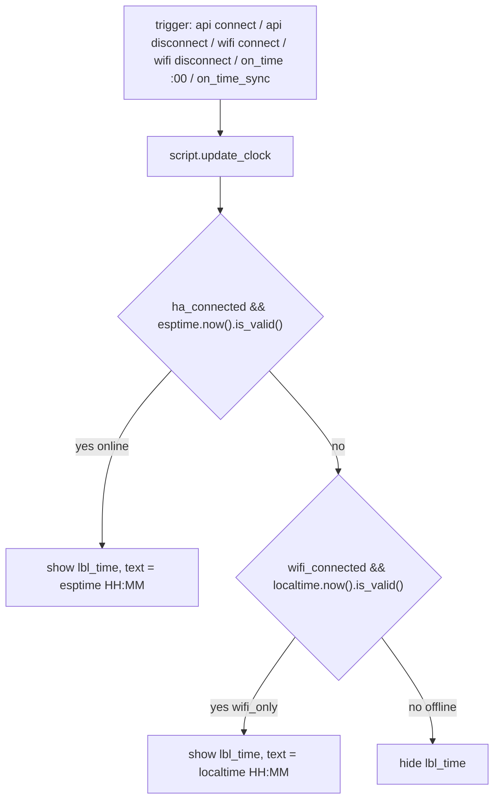

# Plan: No-HA mode — time sync (local NTP-maintained clock until HA API connects)

**Status:** Proposed
**Scope:** Software-only. No external RTC hardware (JC3248W535C has none; the ESPHome internal clock maintained by NTP acts as the "local RTC" while powered).

## Goal

Make the title-bar clock `lbl_time` display time from a locally maintained NTP clock (`sntp` platform, ESPHome internal clock) whenever the device runs in **wifi_only** mode (WiFi up, HA API down), switch to HA-provided time (`esptime`) as soon as the HA API connects (**online** mode), and hide the clock in **offline** mode (no WiFi).

## Mode table (this task covers the clock only)

| Mode | Condition | Clock source | `lbl_time` |
|---|---|---|---|
| offline | `wifi_connected == false` | none | hidden |
| wifi_only | `wifi_connected == true && ha_connected == false` | `localtime` (sntp/NTP) | shown, `HH:MM` from NTP-maintained local clock |
| online | `ha_connected == true` | `esptime` (Home Assistant) | shown, `HH:MM` from HA |

Playback and stations-list behavior per mode remain separate TODO items (stations via HA sensors in online mode, predefined stations in wifi_only mode are future work).

## Design overview

A single reusable `script: update_clock` implements the source-priority decision and is invoked from every relevant trigger, so the mode logic lives in exactly one place:



Rationale:
- `ha_connected` already exists (set in `api.on_client_connected/disconnected` handlers) and flags **online** mode.
- New `wifi_connected` global (set in `wifi.on_connect/on_disconnect`) distinguishes **offline** from **wifi_only** — required because the ESPHome internal clock keeps ticking (and `localtime.now().is_valid()` stays true) after a WiFi drop, and offline mode must hide the clock.
- sntp `on_time_sync` gives an immediate clock refresh right after the first NTP sync (no waiting up to 59 s for the next minute boundary).
- `on_time` at `seconds: 0` on **both** platforms keeps minute-aligned updates in either mode; double execution is harmless (same output string).

## Changes

### 1. `packages/esp-web-radio-homeassistant.yaml` — add the NTP time platform

- Extend the existing `time:` list (currently only `platform: homeassistant`, lines 21–35) with:

```yaml
  - platform: sntp
    id: localtime
    timezone: !secret timezone
    servers:
      - "pool.ntp.org"
      - "time.google.com"
    on_time_sync:
      - script.execute: update_clock
    on_time:
      - seconds: 0
        then:
          - script.execute: update_clock
```

- Replace the body of the `esptime` `on_time` handler (currently lines 25–35, with the inline `ha_connected` condition and `lvgl.label.update`) with a single `- script.execute: update_clock`.
- Update the file header comment (lines 12–20) to describe the dual time source and the priority rule.

### 2. `packages/esp-web-radio-lvgl_ui.yaml` — connection flags + unified clock script

- Add a `globals:` block (new file-level block; merges with existing ones):

```yaml
globals:
  - id: wifi_connected
    type: bool
    restore_value: no
    initial_value: "false"
```

- Add the unified clock script (new file-level `script:` block):

```yaml
script:
  - id: update_clock
    mode: restart
    then:
      - if:
          condition:
            lambda: 'return id(ha_connected) && id(esptime).now().is_valid();'
          then:
            - lvgl.widget.show: lbl_time
            - lvgl.label.update:
                id: lbl_time
                text: !lambda 'return id(esptime).now().strftime("%H:%M");'
          else:
            - if:
                condition:
                  lambda: 'return id(wifi_connected) && id(localtime).now().is_valid();'
                then:
                  - lvgl.widget.show: lbl_time
                  - lvgl.label.update:
                      id: lbl_time
                      text: !lambda 'return id(localtime).now().strftime("%H:%M");'
                else:
                  - lvgl.widget.hide: lbl_time
```

- Rewire the existing triggers (lines 17–51):
  - `api.on_client_connected`: keep `lbl_hastatus` show + `ha_connected = true`; replace the inline `esptime` update block with `- script.execute: update_clock`.
  - `api.on_client_disconnected`: keep `lbl_hastatus` hide + `ha_connected = false`; replace `- lvgl.widget.hide: lbl_time` with `- script.execute: update_clock` (so wifi_only fallback shows local time instead of hiding).
  - `wifi.on_connect`: add `lambda: 'id(wifi_connected) = true;'` and `- script.execute: update_clock`.
  - `wifi.on_disconnect`: add `lambda: 'id(wifi_connected) = false;'` and `- script.execute: update_clock` (hides clock → offline).
- Update the `lbl_time` widget comment (lines 178–179) to reflect the dual source.

### 3. `TODO.md`

- Update the "No-HA mode — time sync" item: mark as implemented with a short note about the dual time source and `update_clock` script.

### 4. Validation

- Run the existing `tests/yaml_syntax_check.py`.
- If secrets available locally, optionally run `esphome config esp-web-radio.yaml --secrets secrets_radio.yaml` to confirm the merged config resolves (two `time` platforms, cross-package `script`/`globals` references).

## Behavior verification matrix

| Scenario | Expected `lbl_time` behavior |
|---|---|
| Boot, no WiFi | hidden (`wifi_connected=false`) |
| WiFi up, no HA, NTP synced | shown with `localtime` HH:MM, updates at `:00` each minute |
| WiFi up, no HA, NTP not yet synced | hidden; appears immediately on `on_time_sync` |
| WiFi + HA connect | switches to `esptime` (HA) time |
| HA disconnects, WiFi still up | falls back to `localtime`, stays visible |
| WiFi drops (offline) | hidden |

## Risks / notes

- **Dual time platforms** require ESPHome with multiple-time-source support (2024.8/2024.9+; project does not pin a version). If compilation fails with a single-time-source error, fall back to making `sntp` the sole time source and note the constraint (HA-time preference would then rely on HA pushing correct time via `homeassistant` platform being removed — needs re-decision). Verify during implementation.
- Both `on_time` handlers fire at `:00` when both sources are valid — `update_clock` is idempotent, so double execution is harmless.
- The `timezone` secret applies to both platforms identically, so wall-clock rendering is consistent regardless of source.
- NTP servers are hard-coded public pool servers (not credentials); adjust in `servers:` if a local NTP source is preferred.

---

## Implementation amendment (2026-09-28) — id renamed `localtime` → `wifi_time`

The original plan named the SNTP time component id `localtime`, which compiled fine with
the then-current toolchain. On the current one (g++ 14.2.0 / IDF 5.5.5) the generated
global C++ variable `localtime` collides with the standard C library function
`tm* localtime(const time_t*)` from `<time.h>`, producing a hard compile error in
`main.cpp` ("redeclared as different kind of entity"). The id was renamed to `wifi_time`:

- declaration: `time: - platform: sntp, id: wifi_time` in
  [`packages/esp-web-radio-homeassistant.yaml`](../packages/esp-web-radio-homeassistant.yaml:27)
- usages: `id(wifi_time).now()` in the `update_clock` script
  ([`packages/esp-web-radio-lvgl_ui.yaml`](../packages/esp-web-radio-lvgl_ui.yaml:52))

An SNTP component persists nothing keyed by its id, so the rename is runtime-safe.
README and TODO wording were aligned to the new id name.