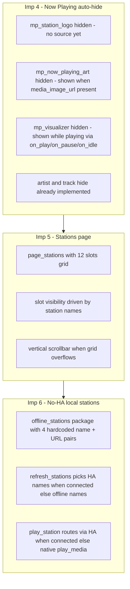

# Plan: Improvements 4–6 — Now Playing widget hiding, Stations page, no-HA local stations

**Status:** Proposed — source of truth for the Code-mode implementation subtask.
**Date:** 2026-09-29
**Scope:** software-only UI/state/config changes; no hardware or HA-side changes; one new LVGL page (Stations), two new packages, no new top-level YAML keys (only new entries under existing `packages:`, `substitutions:`, `lvgl:`, `script:`, `globals:`, `text_sensor:` keys).
**Constraint:** no local `esphome` install — validation limited to `python tests/yaml_syntax_check.py`, grep cross-reference review, and manual review of the merged model. **Never run any `esphome` CLI command.** Two compile-time risk areas existed (native `media_player.play_media`, play-state triggers) — they were resolved during the build-fix round by verifying against the ESPHome docs/source (see [Risks](#risks)); final proof still happens on the build host.

This plan implements **items 1–3 of the "Remaining improvements" section** of [`TODO.md`](TODO.md:22):

| TODO # | Plan # | Title |
|---|---|---|
| 1 | **Improvement 4** | Hide Now Playing widgets/labels when their info is unavailable |
| 2 | **Improvement 5** | Add Stations page — dynamic station button grid (HA sensor names) with vertical scrollbar |
| 3 | **Improvement 6** | No-HA mode — local station list from [`offline_stations.yaml`](offline_stations.yaml:1), with automatic switch back to HA stations on reconnect |



---

## Context recap (from the current code)

- [`packages/esp-web-radio-lvgl_ui.yaml`](packages/esp-web-radio-lvgl_ui.yaml:117) owns `api.on_client_connected/disconnected` (sets `ha_connected`), `wifi.on_connect/on_disconnect` (sets `wifi_connected`), scripts (`update_clock`, `enter_ap_mode`, …), and the LVGL framework incl. `top_layer` bottom-nav `buttonmatrix` (`page_prev`/`page_home`/`page_next` → `lvgl.page.previous/show/next`). `page_wrap: true`; `page_ap_setup` is excluded via `skip: true`.
- [`packages/esp-web-radio-homeassistant.yaml`](packages/esp-web-radio-homeassistant.yaml:67) declares `station_1_url`..`station_4_url` (HA `sensor.radio_station_N_url`), `player_state`, `now_playing`/`now_playing_artist`/`now_playing_track`, `player_volume/position/duration`, and `current_station` (1..4) + `ha_connected` globals. The `station_N_name` sensors are present but **commented out** (lines 86–116) awaiting the Stations page.
- [`packages/esp-web-radio-page_now_playing.yaml`](packages/esp-web-radio-page_now_playing.yaml:26) declares `mp_station_logo`, `mp_now_playing_art`, `mp_visualizer` as **empty placeholder panels** (no image binding yet), plus artist/track labels that already hide on empty.
- [`ha_template_sensors.yaml`](ha_template_sensors.yaml:1) (HA-side) defines 4 stations with **`media-source://radio_browser/…` URLs** — only playable via HA. [`offline_stations.yaml`](offline_stations.yaml:1) defines the same 4 stations with **direct http(s) URLs** — playable by the device itself.
- [`packages/lvgl_theme.yaml`](packages/lvgl_theme.yaml:125) provides `style_definitions` (`card`, `panel`, `text_title`, `text_body`, `text_muted`, `controls_row`, …) — no raw hex colors on pages.
- Root [`offline_stations.yaml`](offline_stations.yaml:1) and [`ha_template_sensors.yaml`](ha_template_sensors.yaml:1) are **HA-side imports**, not part of the ESPHome build.

---

## Improvement 4 — hide Now Playing widgets/labels when info is unavailable

**Goal:** no dead/empty UI areas on the Now Playing page; every widget shows only when its data exists. Artist/track already auto-hide — this batch completes the story for the three placeholder panels.

### 4.1 [`packages/esp-web-radio-page_now_playing.yaml`](packages/esp-web-radio-page_now_playing.yaml:26)

| Widget | Change | Rationale |
|---|---|---|
| `mp_station_logo` (line 38) | add `hidden: true` + comment "station picture binding arrives with roadmap item 4" | No station-picture source exists yet → panel must not render as an empty box |
| `mp_now_playing_art` (line 47) | add `hidden: true` + comment "shown when media_image_url present (binding in homeassistant.yaml)" | Empty box hidden until art metadata exists; actual image rendering is a later roadmap item |
| `mp_visualizer` (line 56) | add `hidden: true` + comment "shown while playing (driven by media_player on_play/on_pause/on_idle)" | Decorative strip only meaningful while audio plays |
| `mp_station_title` (line 65) | `x: 115 → 16`, `width: 249 → 344` | Logo is permanently hidden for now → reclaim the left column; keeps a 13 px gap to the art panel (x 373) |
| `mp_now_playing_artist` (line 74) | `x: 115 → 16`, `width: 249 → 344` | Match title position |
| `mp_lnow_playing_track` (line 85) | `x: 115 → 16`, `width: 249 → 344` | Match title position |

> **Design decision (see [Decisions](#decisions)):** no dynamic per-widget pixel reflow — fixed static positions chosen for the "logo hidden" steady state, which is the only state until roadmap item 4 supplies logos.

### 4.2 [`packages/esp-web-radio-homeassistant.yaml`](packages/esp-web-radio-homeassistant.yaml:42) — new art-presence sensor

Add under `text_sensor:`:

```yaml
  # Album art presence -> show/hide mp_now_playing_art (image rendering is a
  # later roadmap item; the panel appears as a placeholder while art metadata
  # exists). Fallback attribute name: entity_picture.
  - platform: homeassistant
    id: now_playing_art
    entity_id: media_player.esp_media_player
    attribute: media_image_url
    on_value:
      - if:
          condition:
            lambda: return x.length() > 0;
          then:
            - lvgl.widget.show: mp_now_playing_art
          else:
            - lvgl.widget.hide: mp_now_playing_art
```

### 4.3 [`packages/esp-web-radio-audio.yaml`](packages/esp-web-radio-audio.yaml:72) — native play-state hook (drives visualizer + play icon in ALL modes)

Add payload-free `on_play` / `on_pause` / `on_idle` triggers to the `media_player` block (the existing commented `on_state` at lines 88–97 is stale and replaced by this). `on_state` is intentionally NOT used — its callback forwards a `MediaPlayerState` enum, not a string, so `x == "playing"` would not compile:

```yaml
    on_play:
      - logger.log: "media player playing"
      - lambda: 'id(player_playing) = true;'
      - lvgl.widget.show: mp_visualizer
      - lvgl.label.update:
          id: mp_lbl_play_icon
          text: ${text_pause}
    on_pause:
      - logger.log: "media player paused"
      - lambda: 'id(player_playing) = false;'
      - lvgl.widget.hide: mp_visualizer
      - lvgl.label.update:
          id: mp_lbl_play_icon
          text: ${text_play}
    on_idle:
      - logger.log: "media player idle"
      - lambda: 'id(player_playing) = false;'
      - lvgl.widget.hide: mp_visualizer
      - lvgl.label.update:
          id: mp_lbl_play_icon
          text: ${text_play}
```

Add global `player_playing` (bool, initial `false`, `restore_value: no`) in [`packages/esp-web-radio-homeassistant.yaml`](packages/esp-web-radio-homeassistant.yaml:272) next to `ha_connected`. The existing HA `player_state` sensor keeps updating `mp_lbl_play_icon` too — both reflect the same truth (state is pushed from the same player), so no conflict.

> **Resolution (build-fix round):** `on_state` forwards a `MediaPlayerState` enum, so the payload-free `on_play`/`on_pause`/`on_idle` triggers are used instead; fallback (if a platform lacks them) = drive visualizer/icon only from the HA `player_state` sensor.

### 4.4 `mp_btn_play` — use the local flag

Change the `mp_btn_play` press condition in [`packages/esp-web-radio-page_now_playing.yaml`](packages/esp-web-radio-page_now_playing.yaml:178) from `id(player_state).state == "playing"` to `id(player_playing)` so play/pause toggling also works without HA (HA branch still goes through `homeassistant.action`, which is a no-op offline — acceptable, or gate it with `if ha_connected`; see 6.4).

---

## Improvement 5 — Stations page (dynamic button grid)

**Goal:** a third navigable page listing the available stations as buttons; the set of visible buttons follows whatever station-name data is available; a vertical scrollbar appears if the list overflows one screen.

### 5.1 New package [`packages/esp-web-radio-page_stations.yaml`](packages/esp-web-radio-page_stations.yaml) (new file)

`lvgl.pages` entry `page_stations` (NOT `skip: true` — it joins prev/next/swipe navigation; order in the pages list determines position, inserted as the second page so `page_next` from Now Playing reaches it):

- `pad_all: 0`, **`scrollbar_mode: AUTO`** (page-level; pages already accept this key — see `page_now_playing` line 25).
- Title label `st_title`: `styles: text_title`, `text: "Станции"`, x 16, y 12, width 200, height 30, `text_align: LEFT`.
- Grid container `st_grid`: plain `obj`, x 0, y 48, width 480, `pad_all: 0`, transparent (no style), `scrollbar_mode: OFF`. Its height is set **at runtime** by `refresh_stations` (see 5.3) to `rows_visible * 56`.
- **12 slot buttons** `st_btn_1` .. `st_btn_12`, each `hidden: true` initially, each containing a label child `st_lbl_N`:
  - Slot geometry: column 1 → `x: 16`, column 2 → `x: 240` (both `width: 224`, `height: 52`); row `r` (0-based) → `y: r * 56` inside `st_grid`. 12 slots = 6 rows → grid height 336 px > viewport (~230 px below the title and above the bottom nav overlay) → page scrolls vertically with a visible scrollbar only when 9+ slots are shown.
  - `st_lbl_N`: `styles: text_body`, `text_font: ${font_body}`, `long_mode: SCROLL`, aligned left with small `pad_left: 12`, placeholder `text: ""`.
  - Button look: new `station_button` style (see 5.2).
  - Each `st_btn_N` `on_press`:
    ```yaml
    - lambda: 'id(current_station) = N;'
    - script.execute: play_station
    ```
- Page header comment documents the bindings (station name sensors ↔ slot labels, play_station routing).

### 5.2 [`packages/lvgl_theme.yaml`](packages/lvgl_theme.yaml:125) — add `station_button` style

```yaml
    - id: station_button
      bg_color: ${color_panel}
      bg_grad_color: ${color_panel_grad}
      bg_grad_dir: VER
      bg_opa: COVER
      border_width: 1
      border_color: ${color_border}
      radius: 12
      pad_all: 0
      pressed:
        bg_color: ${color_accent}
        bg_grad_color: ${color_accent_dark}
        bg_grad_dir: VER
        text_color: 0xFFFFFF
```

(Keeps the "no raw hex on pages" rule; the only literals are inside the theme package, matching existing style.)

### 5.3 [`packages/esp-web-radio-homeassistant.yaml`](packages/esp-web-radio-homeassistant.yaml:86) — enable station name sensors

Uncomment/replace the four commented `station_1_name` .. `station_4_name` blocks so each becomes:

```yaml
  - platform: homeassistant
    id: station_1_name
    entity_id: sensor.radio_station_1_name
    on_value:
      - script.execute: refresh_stations
```

(the old `btnN_label` updates are replaced by the single `refresh_stations` script). Extension path for >4 stations: add `station_5_name`/`station_5_url` here, matching rows in [`ha_template_sensors.yaml`](ha_template_sensors.yaml:1) and in [`offline_stations.yaml`](offline_stations.yaml:1); slots 5–12 already exist.

### 5.4 [`packages/esp-web-radio-lvgl_ui.yaml`](packages/esp-web-radio-lvgl_ui.yaml:37) — `refresh_stations` script

`mode: restart` (self-debouncing). Body for each slot N in 1..12:

1. Compute effective name: `name = (id(ha_connected) && id(station_N_name).has_state() && id(station_N_name).state.length() > 0) ? id(station_N_name).state : (N <= 4 ? "<offline_station_N_name>" : "")`.
2. `lvgl.label.update: st_lbl_N` with the name (skip if empty).
3. `if name empty → lvgl.widget.hide: st_btn_N else → lvgl.widget.show: st_btn_N`.
4. After the loop, lambda: count visible buttons → `rows = (count + 1) / 2` → `lv_obj_set_height(id(st_grid), rows * 56);`.

The 12 lambdas are verbose but mechanical; a single comment block explains the formula. This single script is the **one source of truth** for station-list population and is triggered from:

- `wifi.on_connect` (fills offline names immediately; HA not yet connected),
- `api.on_client_connected` — after a `delay: 500ms` (lets sensor states arrive; avoids the flag-vs-value race),
- `api.on_client_disconnected` (falls back to offline names),
- `on_boot` in [`esp-web-radio.yaml`](esp-web-radio.yaml:19) (append `- script.execute: refresh_stations`),
- every `station_N_name` `on_value`.

---

## Improvement 6 — No-HA mode local station list

**Goal:** the device remains fully usable when WiFi is up but HA is unreachable: Stations page shows the built-in list, playback goes straight to the stream URL, and everything switches back automatically when HA reconnects.

### 6.1 New package [`packages/esp-web-radio-offline_stations.yaml`](packages/esp-web-radio-offline_stations.yaml) (new file)

Storage decision: **hardcoded substitutions in a dedicated package** (mirrors the 4 entries of [`offline_stations.yaml`](offline_stations.yaml:1) with direct URLs):

```yaml
# Hardcoded station list for no-HA mode (device-side fallback when the HA API
# is unavailable). Mirrors the HA-side template sensors in offline_stations.yaml.
substitutions:
  offline_station_1_name: "Радио Дача"
  offline_station_1_url:  "http://listen13.vdfm.ru:8000/dacha"
  offline_station_2_name: "Авторадио"
  offline_station_2_url:  "https://online2.gkvr.ru:8001/avtoradio_mzd_64.aac"
  offline_station_3_name: "Русское Радио"
  offline_station_3_url:  "https://rusradio.hostingradio.ru/rusradio96.aacp"
  offline_station_4_name: "Наше Радио"
  offline_station_4_url:  "http://nashe.streamr.ru/nashe-128.mp3"
```

### 6.2 [`esp-web-radio.yaml`](esp-web-radio.yaml:61) — include the new packages

```yaml
  offline_stations: !include packages/esp-web-radio-offline_stations.yaml
  page_stations:    !include packages/esp-web-radio-page_stations.yaml
```

Also add `station_count: 4` to `substitutions:` (used by prev/next wrap logic; raise when more stations are declared).

### 6.3 [`packages/esp-web-radio-lvgl_ui.yaml`](packages/esp-web-radio-lvgl_ui.yaml:37) — `play_station` script (single routing point)

No parameters (avoids the script-`parameters` feature dependency). Reads `current_station`, then:

```yaml
  - id: play_station
    mode: restart
    then:
      - if:
          condition:
            lambda: 'return id(ha_connected);'
          then:
            - homeassistant.action:     # media-source:// URLs need HA resolution
                action: media_player.play_media
                data:
                  entity_id: media_player.esp_media_player
                  media_content_id: !lambda |-
                    int s = id(current_station);
                    if (s == 1) return id(station_1_url).state.c_str();
                    if (s == 2) return id(station_2_url).state.c_str();
                    if (s == 3) return id(station_3_url).state.c_str();
                    return id(station_4_url).state.c_str();
                  media_content_type: "audio/mpeg"
          else:
            - media_player.play_media:  # direct stream URL, no HA needed
                id: esp_media_player
                media_url: !lambda |-   # native action schema: media_url (templatable)
                  int s = id(current_station);
                  if (s == 1) return "${offline_station_1_url}";
                  if (s == 2) return "${offline_station_2_url}";
                  if (s == 3) return "${offline_station_3_url}";
                  return "${offline_station_4_url}";
            - lvgl.label.update:         # no HA metadata offline - show our own
                id: mp_station_title
                text: !lambda |-
                  int s = id(current_station);
                  if (s == 1) return "${offline_station_1_name}";
                  if (s == 2) return "${offline_station_2_name}";
                  if (s == 3) return "${offline_station_3_name}";
                  return "${offline_station_4_name}";
      - lvgl.page.show: ${homepage}      # return to Now Playing after selection
```

> **Compile-risk flag:** native `media_player.play_media` action (ESPHome ≥ ~2024.7). If the installed ESPHome lacks it, no-HA playback is impossible without a custom component — decide at build time (see [Risks](#risks)).

### 6.4 [`packages/esp-web-radio-page_now_playing.yaml`](packages/esp-web-radio-page_now_playing.yaml:150) — rewire prev/next + play

- `mp_btn_prev`: replace the inline URL lambda + `homeassistant.action` with
  ```yaml
  - lambda: 'id(current_station) = ((id(current_station) + ${station_count} - 2) % ${station_count}) + 1;'
  - script.execute: play_station
  ```
- `mp_btn_next`: same pattern with `id(current_station) = (id(current_station) % ${station_count}) + 1;`
- `mp_btn_play` (4.4): condition → `id(player_playing)`; on press, if `ha_connected` use the existing `homeassistant.action` play/pause; else no-op is acceptable (offline toggle via native actions is out of scope) — simplest: keep `homeassistant.action` unconditionally (fails silently offline) or gate with `if ha_connected`. Recommended: gate with `if ha_connected`, else do nothing.

### 6.5 Interaction with AP mode

No change: with no WiFi at all, the device enters AP mode (existing behavior) — the offline list is for the **wifi_only** mode. `wifi.on_disconnect` already hides `wifi_status` and stops station data flowing; `refresh_stations` is re-run on the next `wifi.on_connect`/AP exit path via existing handlers.

---

## Decisions (review points)

1. **Layout reflow** — static repositioning only (title/artist/track moved left once, since the logo has no source today). No per-widget runtime pixel shuffling. Dynamic reflow can be added with roadmap item 4 (logos).
2. **Art panel behavior** — hidden by default; shown as an empty placeholder whenever `media_image_url` is present. Rendering the actual image is roadmap item 4/5.
3. **Slot count** — 12 slots (2 cols × 6 rows). Scrollbar becomes visible at 9+ active stations; with today's 4 stations the grid is compact and scroll-free. Fewer slots mean less YAML but lose the honest scrollbar demo.
4. **Play/pause offline** — offline toggling uses native actions only where trivial; `mp_btn_play` is gated on `ha_connected` (HA route) so offline presses are ignored rather than erroring.
5. **Naming** — this batch is "Improvements 4–6" to continue the plan numbering of [`plans/improvements-1-3.md`](plans/improvements-1-3.md:1); it implements TODO "Remaining improvements" items 1–3.

---

## File-by-file change summary

| File | Change |
|---|---|
| [`packages/esp-web-radio-page_now_playing.yaml`](packages/esp-web-radio-page_now_playing.yaml:26) | Hide 3 panels (+comments); reposition title/artist/track to x 16 / width 344; rewire prev/next to `play_station`; `mp_btn_play` uses `player_playing` + HA gate |
| [`packages/esp-web-radio-homeassistant.yaml`](packages/esp-web-radio-homeassistant.yaml:42) | Enable `station_1_name`..`station_4_name` (→ `refresh_stations`); add `now_playing_art` sensor; add `player_playing` global |
| [`packages/esp-web-radio-audio.yaml`](packages/esp-web-radio-audio.yaml:72) | Add `media_player.on_play/on_pause/on_idle` (visualizer + play icon + `player_playing`); remove/replace stale commented block |
| [`packages/esp-web-radio-page_stations.yaml`](packages/esp-web-radio-page_stations.yaml) | **NEW** — `page_stations`, title, `st_grid`, 12 slot buttons + labels |
| [`packages/esp-web-radio-offline_stations.yaml`](packages/esp-web-radio-offline_stations.yaml) | **NEW** — 4 hardcoded offline name/URL substitutions |
| [`packages/esp-web-radio-lvgl_ui.yaml`](packages/esp-web-radio-lvgl_ui.yaml:37) | Add `refresh_stations` + `play_station` scripts; hook them into `wifi.on_connect`, `api.on_client_connected/disconnected` |
| [`packages/lvgl_theme.yaml`](packages/lvgl_theme.yaml:125) | Add `station_button` style definition |
| [`esp-web-radio.yaml`](esp-web-radio.yaml:9) | Add `station_count` substitution; include the 2 new packages; append `refresh_stations` to `on_boot` |
| [`tests/yaml_syntax_check.py`](tests/yaml_syntax_check.py:10) | Add the 2 new package files to the checked-file list |
| [`README.md`](README.md:1) | Features, project tree, page count ("Two pages" → three), bindings table, station cycling section, device-modes table (station source per mode), roadmap pointer |
| [`TODO.md`](TODO.md:22) | Mark "Remaining improvements" items 1–3 `[x]` with mechanism notes; move to Completed |

---

## Validation (without local esphome)

1. **YAML syntax** — `python tests/yaml_syntax_check.py` — all 10 listed files `OK` (8 existing + 2 new packages).
2. **Grep cross-reference checks:**
   - Every `lvgl.widget.show/hide/update` and `lvgl.label.update` target exists exactly once as a widget id: `mp_station_logo`, `mp_now_playing_art`, `mp_visualizer`, `st_grid`, `st_btn_1..12`, `st_lbl_1..12`, `mp_lbl_play_icon`, `mp_station_title`.
   - Substitutions used are defined: `offline_station_N_name/url`, `station_count`.
   - No leftover references to the removed old pattern (`btn1_label`..`btn4_label`, old `homeassistant.action` in `mp_btn_prev/next`).
   - `refresh_stations` / `play_station` scripts exist and every `script.execute` reference resolves.
   - No duplicate ids across packages; no new top-level keys.
3. **Merged-model review** — the only new `lvgl.pages` entry is `page_stations`; `page_ap_setup` stays `skip: true`; theme/style single-source rule preserved (only `lvgl_theme.yaml` gets the new style).
4. **Hardware verification deferred** (per plan conventions): page scrolling/scrollbar, offline playback, play-state icon sync, art panel behavior.

## Acceptance criteria (behavior matrix)

| Scenario | Expected |
|---|---|
| HA connected, no album art | `mp_now_playing_art` hidden; title/artist/track at x 16 |
| HA connected, album art present | `mp_now_playing_art` visible (placeholder panel) |
| Player stopped/idle (any mode) | `mp_visualizer` hidden, play icon shows `${text_play}` |
| Player playing (any mode) | `mp_visualizer` visible, play icon shows `${text_pause}` |
| Stations page, HA connected | 4 buttons: "Радио Дача", "Авторадио", "Русское Радио", "Наше Радио"; no scrollbar |
| Stations page, 9+ stations | vertical scrollbar appears; page scrolls |
| Press station on Stations page | plays that station via HA (`media-source://`), returns to Now Playing |
| HA unreachable, WiFi up (wifi_only) | Stations page shows the 4 offline names; pressing one plays the direct http(s) URL via native `play_media`; `mp_station_title` shows the offline station name |
| HA reconnects | Stations page switches back to HA names; playback routes through HA again |
| `mp_btn_prev`/`mp_btn_next` | wrap across `${station_count}` stations using the correct URL source per mode |
| `mp_btn_play` offline | press ignored (no crash, no API error) |

## Risks

- **No local esphome** → schema correctness unproven locally. Highest-risk construct remaining: page-level vertical scroll with `scrollbar_mode: AUTO`. The native `media_player.play_media` action and the play-state triggers were verified against the ESPHome docs/source during the build-fix round (`media_url` parameter — not HA's `media_content_id`/`media_content_type`; `on_play`/`on_pause`/`on_idle` instead of `on_state`). Fallbacks remain: HA-only routing; `player_state`-driven UI; static grid without scroll.
- **`media-source://` URLs** — must keep routing through HA when connected; the offline branch must never feed them to native playback.
- **Race on reconnect** — `station_N_name` values may arrive before/around `ha_connected`; mitigated by the 500 ms delay + `mode: restart` debounce in `refresh_stations`.
- **Duplicate play-icon writers** — the media_player play-state triggers and the HA `player_state` sensor both update `mp_lbl_play_icon`; values agree, but keep both writers idempotent.
- **12 declared-but-hidden slots** — small RAM cost (LVGL objects); acceptable; never remove the `st_btn_N` ids while `refresh_stations` references them (orphan-widget rule).
- **Bottom nav overlap** — `page_stations` content starts at y 48; bottom nav overlays the last ~40 px; grid height math accounts for it (scroll area ends above the nav).