# Миграция радиостанций на Music Assistant

> Статус: план (архитектура), реализация — отдельной Code-подзадачей.
> Файлы, которые изменятся в репозитории: `esp-web-radio.yaml`,
> `packages/esp-web-radio-lvgl_ui.yaml`, `packages/esp-web-radio-homeassistant.yaml`,
> `ha_template_sensors.yaml` (импортируется в HA, вне ESPHome-сборки), `README.md`.
> Новых файлов не создаётся. Офлайн-путь, announcement/TTS и визуализатор не трогаем.

---

## 1. Контекст и цель

Сейчас онлайн-воспроизведение идёт так:

```
Stations page / prev-next → play_station (HA-ветка)
  → homeassistant.action media_player.play_media
      entity_id: media_player.esp_media_player
      media_content_id: sensor.radio_station_N_url = "media-source://radio_browser/<uuid>"
      media_content_type: "audio/mpeg"
  → HA резолвит media-source://radio_browser/<uuid> в stream URL → отправляет на ESPHome-плеер
```

Проблемы прошлых сессий: radio_browser **не транскодирует** — AAC/HE-AAC станции
дают `ESP_ERR_NOT_SUPPORTED` на декодере ESPHome, а HTTPS-стримы падают на TLS.
Решение: перевести станции на **Music Assistant** — MA сам декодирует любой входной
кодек в PCM и кодирует в кодек плеера, т.е. до ESPHome всегда доходит кодек из
списка поддерживаемых (FLAC/MP3/OPUS/WAV).

Целевой принцип: управление воспроизведением уходит на **MA-зеркало** сущности
(создаётся интеграцией `music_assistant` в HA), а не на `media_player.esp_media_player`
напрямую. Аудио-путь на устройстве (media_pipeline → resampler → mixer →
spectrum_tap → I2S → PCM5102) не меняется вообще.

---

## 2. Текущее состояние кода (as-is, что нашли при чтении)

| Файл | Что делает сейчас |
|---|---|
| [`esp-web-radio.yaml`](../esp-web-radio.yaml:9) | `substitutions:` — `ap_*`, `station_count: 4`; `packages:` подключает `homeassistant`, `offline_stations`, `lvgl_ui`, … |
| [`packages/esp-web-radio-lvgl_ui.yaml`](../packages/esp-web-radio-lvgl_ui.yaml:345) | Скрипт `play_station`: HA-ветка — `homeassistant.action media_player.play_media` c `entity_id: media_player.esp_media_player`, `media_content_type: "audio/mpeg"`; офлайн-ветка — нативный `media_player.play_media` (`id: esp_media_player`, прямой URL из `offline_station_N_url`) |
| [`packages/esp-web-radio-homeassistant.yaml`](../packages/esp-web-radio-homeassistant.yaml:39) | `text_sensor platform: homeassistant`: `station_1..12_url` (→ `sensor.radio_station_N_url`), `station_1..12_name`, сенсоры метаданных `now_playing`, `now_playing_artist`, `now_playing_track`, `now_playing_art` — все читают атрибуты с `media_player.esp_media_player`; `player_state` (→ glyph play/pause), `player_position`/`player_duration` (прогресс), `media_player_state` (публикация состояния в HA) |
| [`ha_template_sensors.yaml`](../ha_template_sensors.yaml:1) | HA-side template-сенсоры: `Radio Station N Name` + `Radio Station N URL` = `media-source://radio_browser/<uuid>` (4 станции) |
| [`packages/esp-web-radio-audio.yaml`](../packages/esp-web-radio-audio.yaml:95) | `media_player platform: speaker` `esp_media_player`: `media_pipeline format: NONE` (все декодеры), announcement-пиплайн FLAC, триггеры on_play/on_pause/on_idle (glyph + visualizer + `player_playing`), on_volume/on_mute/on_unmute; guarded HA push `is_volume_muted` на `media_player.esp_media_player` |
| [`packages/esp-web-radio-page_now_playing.yaml`](../packages/esp-web-radio-page_now_playing.yaml:477) | `mp_btn_play` в HA-ветке вызывает `media_player.media_pause`/`media_player.media_play` с `entity_id: media_player.esp_media_player`; остальные кнопки — нативные действия на `esp_media_player` |
| [`packages/esp-web-radio-offline_stations.yaml`](../packages/esp-web-radio-offline_stations.yaml:14) | substitutions `offline_station_N_name/url` — **не трогаем** |
| [`offline_stations.yaml`](../offline_stations.yaml:1) | HA-side зеркало офлайн-списка (прямые URL) — **не трогаем** |

---

## 3. Целевая схема (to-be)

### 3.1 Диаграмма потока

```mermaid
flowchart LR
    A[LVGL UI станция] --> B[play_station скрипт HA-ветка]
    B -->|play_media entity mirror content library://radio uuid type music| C[MA-зеркало media_player в HA]
    C --> D[HA интеграция music_assistant]
    D --> E[MA server аддон >= 2.4]
    E --> F[провайдер Radio Browser]
    E --> G[декод входа AAC HE-AAC до PCM]
    G --> H[кодирование в кодек плеера MP3 дефолт либо FLAC 48k 16bit]
    H --> I[сессионный stream URL без стабильного адреса]
    I -->|аудио| J[ESPHome media_player esp_media_player]
    J --> K[media_pipeline декоды FLAC MP3 OPUS WAV]
    K --> L[resampler 48 кГц стерео]
    L --> M[mixer main_mixer_speaker]
    M --> N[spectrum_tap FFT визуализатор]
    N --> O[I2S DAC PCM5102]
    O --> P[усилитель]

    C -->|атрибуты media_title media_artist media_image_url| Q[сенсоры now_playing artist track art]
    Q --> R[LVGL лейблы Now Playing]

    S[офлайн ветка play_station] -->|нативный play_media прямой URL| J
    T[announcement pipeline FLAC] --> M
```



Два независимых контура:

1. **Управление (control)**: кнопка → `play_station` → `homeassistant.action`
   на **MA-зеркало** с `media_content_id: library://radio/<favorite_uuid>`,
   `media_content_type: "music"`. Дальше HA-интеграция `music_assistant` передаёт
   команду в MA server, MA запускает favorite через провайдера Radio Browser.
2. **Аудио (media)**: MA генерирует **сессионный** stream URL и отдаёт его
   ESPHome-плееру (`esp_media_player`). Устройство ничего не знает про MA —
   для него это обычный http(s)-поток в поддерживаемом кодеке (MP3/FLAC/OPUS/WAV).
   Весь существующий audio-конвейер (decode → resample → mixer → spectrum_tap →
   I2S → PCM5102) работает без изменений; визуализатор и announcement/TTS не ломаются.

### 3.2 Почему именно MA-зеркало, а не `media_player.esp_media_player`

- Метаданные (`media_title`/`media_artist`/`media_image_url`) гарантированно
  заполняются на **MA-зеркале**; на исходной ESPHome-сущности при управлении от MA
  они, вероятно, пустые (ICY injection off).
- MA-зеркало понимает `library://`-URI и `media_content_type: "music"`;
  direct ESPHome-плеер такие значения не резолвит.
- Прямых стабильных stream-URL у MA нет — URL живёт только в рамках сессии,
  поэтому **сенсоры URL не трогаем**: они продолжают отдавать value в `play_station`,
  меняется только содержимое (favorite URI вместо radio_browser) и способ запуска.

### 3.3 Выходной кодек: MP3 (дефолт) vs FLAC (рекомендуемая опция)

MA даёт на плеере настройку «Output codec to use for streaming audio to the player»
(см. §9-6 про то, что список кодеков зависит от версии/провайдера). Оба варианта
устройство декодирует штатно (`media_pipeline format: NONE` = все декодеры,
FLAC проверен исторически: до этой миграции HA транскодировал стримы в FLAC,
а announcement-пиплайн и сейчас FLAC).

| | MP3 (дефолт MA) | FLAC (опция) |
|---|---|---|
| Качество | lossy → второй пережим (генерационная потеря: AAC 128k → PCM → MP3) | lossless → дополнительной потери нет (AAC 128k → PCM → FLAC) |
| Битрейт/нагрузка на сеть | ~128–320 kbps — лёгкий | ~0.8–1.5 Mbps (48 kHz/16 bit стерео) — WiFi справляется |
| Декод на ESP32-S3 | лёгкий | заметно тяжелее, но прецедент есть (HA→FLAC работал ранее) |
| Риск при слабом WiFi / обрывах | ниже (меньше данных) | выше (больше данных, больше буфер) |

**Рекомендация:** начинать миграцию с **MP3** (дефолт MA, минимальный риск),
затем в настройках плеера MA переключить на **FLAC** и прогнать чеклист §7 —
если звук стабилен (без заиканий/ESP_ERR_NOT_SUPPORTED), оставить FLAC как
постоянный вариант: он исключает вторую lossy-стадию, а устройство декодирует
FLAC без проблем. MP3 остаётся fallback'ом при нестабильной сети/обрывах.

---

## 4. Изменения в репозитории (по файлам)

### 4.1 [`esp-web-radio.yaml`](../esp-web-radio.yaml:9) — новая substitution `${ma_player_entity}`

**Где объявить:** в главном файле, в блоке `substitutions:` рядом с `station_count`.
Обоснование: substitution используется в **двух** пакетах
(`lvgl_ui` — `play_station`, `homeassistant` — сенсоры метаданных), а substitutions
в ESPHome мержатся глобально по всему конфигу; объявление в главном файле повторяет
уже существующий паттерн `station_count` (объявлен в главном, используется в
`lvgl_ui`/`page_now_playing`). Отдельный пакет не нужен — там нет никакой другой логики.

**Разумный дефолт:** `media_player.esp_media_player`. Пока реальный entity_id
зеркала не известен (он появляется только после импорта), конфиг компилируется и
ведёт себя ровно как сегодня. Миграция «включается» одной правкой строки.
⚠️ Дефолт означает СТАРОЕ поведение — см. «Порядок внедрения» (§6): сначала MA,
потом переключение.

Сниппет (добавить в блок `substitutions:`):

```yaml
substitutions:
  ap_ssid: "ESP Radio Fallback"     # keep in sync with wifi.ap.ssid below
  ap_password: !secret ap_password  # fallback AP password - WIFI: QR + wifi.ap.password below
  ap_password_display: !secret ap_password   # shown on the AP setup page
  ap_url: "http://192.168.4.1"      # fallback AP URL - text on the AP setup page
  station_count: 4                  # station presets (1..N); raise when more are declared
  # Music Assistant mirror of the device player. Created by the music_assistant
  # integration when the player provider "Home Assistant Media Players" is
  # configured in MA (see README "Music Assistant"). Find the real entity_id in
  # HA: Settings -> Devices & services -> Music Assistant.
  # Default = the direct ESPHome entity -> keeps today's behavior until the
  # mirror is imported; MUST be switched to the mirror for playback through MA.
  ma_player_entity: "media_player.esp_media_player"
```

### 4.2 [`packages/esp-web-radio-lvgl_ui.yaml`](../packages/esp-web-radio-lvgl_ui.yaml:352) — `play_station`, HA-ветка

Меняем только HA-ветку (`if ha_connected then:`). Офлайн-ветка (`else:`,
нативный `media_player.play_media` + локальный title) — **без изменений**.

Было:

```yaml
            - homeassistant.action:
                action: media_player.play_media
                data:
                  entity_id: media_player.esp_media_player
                  media_content_id: !lambda |-
                    int s = id(current_station);
                    if (s == 1) return id(station_1_url).state.c_str();
                    # ... (s == 2..11, без изменений)
                    return id(station_12_url).state.c_str();
                  media_content_type: "audio/mpeg"
```

Стало:

```yaml
            - homeassistant.action:
                action: media_player.play_media
                data:
                  entity_id: ${ma_player_entity}
                  media_content_id: !lambda |-
                    # lambda БЕЗ ИЗМЕНЕНИЙ - значение по-прежнему приходит из
                    # sensor.radio_station_N_url (теперь это library://radio/<uuid>)
                    int s = id(current_station);
                    if (s == 1) return id(station_1_url).state.c_str();
                    if (s == 2) return id(station_2_url).state.c_str();
                    if (s == 3) return id(station_3_url).state.c_str();
                    if (s == 4) return id(station_4_url).state.c_str();
                    if (s == 5) return id(station_5_url).state.c_str();
                    if (s == 6) return id(station_6_url).state.c_str();
                    if (s == 7) return id(station_7_url).state.c_str();
                    if (s == 8) return id(station_8_url).state.c_str();
                    if (s == 9) return id(station_9_url).state.c_str();
                    if (s == 10) return id(station_10_url).state.c_str();
                    if (s == 11) return id(station_11_url).state.c_str();
                    return id(station_12_url).state.c_str();
                  media_content_type: "music"
```

Комментарий в шапке скрипта (строки ~338-344) обновить: «HA-ветка идёт через
MA-зеркало (${ma_player_entity}), контент — library:// URI».

### 4.3 [`packages/esp-web-radio-homeassistant.yaml`](../packages/esp-web-radio-homeassistant.yaml:207) — сенсоры метаданных

Меняем `entity_id` у четырёх сенсоров на `${ma_player_entity}`:

| Сенсор | attribute | Было | Стало |
|---|---|---|---|
| `now_playing` | `media_title` | `media_player.esp_media_player` | `${ma_player_entity}` |
| `now_playing_artist` | `media_artist` | `media_player.esp_media_player` | `${ma_player_entity}` |
| `now_playing_track` | `media_title` | `media_player.esp_media_player` | `${ma_player_entity}` |
| `now_playing_art` | `media_image_url` | `media_player.esp_media_player` | `${ma_player_entity}` |

Сниппет (пример, применять ко всем четырём блокам):

```yaml
  # Station name (large page title) - metadata comes from the MA mirror
  - platform: homeassistant
    id: now_playing
    entity_id: ${ma_player_entity}
    attribute: media_title
    on_value:
      - lvgl.label.update:
          id: mp_station_title
          text: !lambda return x.c_str();
```

**`player_state` оставляем на `media_player.esp_media_player`** (строка ~189) — без
изменений. Обоснование:

- Глиф play/pause на `mp_lbl_play_icon` уже дублируется нативными
  `on_play`/`on_pause`/`on_idle` из `esp-web-radio-audio.yaml` — это истина самого
  устройства и работает одинаково в online и wifi_only режимах;
- состояние MA-зеркала может отставать или временно расходиться (переподключение
  MA server, ресинк статуса), что давало бы мерцание глифа;
- сенсор на исходной сущности не мешает MA-управлению: state публикуется устройством,
  а не управляется.

**Не меняем** также: `media_player_state` (публикация состояния устройства в HA),
`player_position`/`player_duration` (у живых радио-стримов позиции/длительности нет
ни у кого; если позже окажется, что MA-зеркало их заполняет — вынесем, но это вне
объёма миграции), `station_1..12_url`/`station_1..12_name` (структура сенсоров
сохраняется, меняются только значения на стороне HA — см. 4.4).

### 4.4 [`ha_template_sensors.yaml`](../ha_template_sensors.yaml:1) — favorite-URI вместо radio_browser

Имена сенсоров и структура файла **сохраняются** (импорт в HA по-прежнему создаёт
`sensor.radio_station_N_url/name`). Меняются только значения URL-сенсоров и
добавляется комментарий-инструкция. Файл вне ESPHome-сборки — правка применяется
повторным импортом в HA.

```yaml
- sensor:
#список радиостанций
# ── Music Assistant миграция ──────────────────────────────────────────────
# URL-сенсоры теперь несут MA favorite-URI вида  library://radio/<favorite_uuid>
# вместо media-source://radio_browser/<uuid>. Действует ТОЛЬКО при
# ma_player_entity = MA-зеркало (см. README "Music Assistant") и при
# установленном аддоне Music Assistant + интеграции music_assistant в HA.
#
# Как получить реальные UUID favorites:
#   1) В MA UI (Music Assistant): Providers -> Radio Browser, найдите станцию и
#      добавьте в избранное (звёздочка / Library -> Favorites).
#   2) Проиграйте favorite через MA UI на любом плеере, затем в HA откройте
#      Настройки -> Журнал (Logbook) и найдите запись media_player.play_media:
#      в поле media_content_id будет ТОЧНЫЙ URI вида library://radio/<uuid>.
#   3) Либо в HA: Разработчик -> Сервисы -> music_assistant.search, параметры
#      query = имя станции, searchType = radio; в ответе будет поле uri.
# После правки заново импортируйте файл в HA (Настройки -> Устройства и службы
# -> Импорт элементов / или замените существующие шаблонные сенсоры).
# ──────────────────────────────────────────────────────────────────────────
  - name: "Radio Station 1 Name"
    state: "Радио Дача"
  - name: "Radio Station 1 URL"
    state: "library://radio/<favorite_uuid_1>"
  - name: "Radio Station 2 Name"
    state: "Авторадио"
  - name: "Radio Station 2 URL"
    state: "library://radio/<favorite_uuid_2>"
  - name: "Radio Station 3 Name"
    state: "Русское Радио"
  - name: "Radio Station 3 URL"
    state: "library://radio/<favorite_uuid_3>"
  - name: "Radio Station 4 Name"
    state: "Наше Радио"
  - name: "Radio Station 4 URL"
    state: "library://radio/<favorite_uuid_4>"
```

Если формат URI окажется иным (см. §9 ⚠️1) — подставить фактический
`media_content_id` из Logbook. Допустимый fallback (⚠️3): передавать **имя станции**
(например, `"Радио Дача"`) — MA умеет матчить по имени, но это менее надёжно, чем UUID.

### 4.5 [`README.md`](../README.md:1) — раздел «Music Assistant»

Добавить раздел (рекомендуемое место: сразу после «Station selection & playback
routing», перед «Time sync & device modes»), содержимое:

- **Что изменилось и зачем**: онлайн-станции играют через Music Assistant
  (транскодинг AAC/HE-AAC, метаданные с MA-зеркала); офлайн/no-HA путь не изменился.
- **Настройка на стороне HA** (краткая версия §5 со ссылкой на план):
  1. Установить аддон Music Assistant на HAOS и интеграцию `music_assistant`
     в HA (нужен MA server ≥ 2.4; плагин MA Home Assistant на HAOS ставится сам).
  2. В MA UI добавить Player provider «Home Assistant Media Players», выбрать
     `media_player.esp_media_player`.
  3. Добавить Music source «Radio Browser».
  4. Создать favorites для станций (Radio Browser → избранное).
  5. Определить entity_id MA-зеркала: HA → Настройки → Устройства и службы →
     Music Assistant → сущности media_player; вписать в `ma_player_entity` в
     [`esp-web-radio.yaml`](../esp-web-radio.yaml) (дефолт = `media_player.esp_media_player`,
     т.е. старое поведение, пока не переключено).
  6. Определить favorite-URI (Logbook после первого запуска через MA UI, либо
     `music_assistant.search`) и вписать в [`ha_template_sensors.yaml`](../ha_template_sensors.yaml);
     переимпортировать файл в HA.
- **Таблица соответствия станция → URI** (4 строки: имя, `library://radio/<uuid>`).
- **Кодек**: поток для HA-плееров по умолчанию MP3 (48 kHz/16 bit — макс. для HA
  плеера); весь вход декодируется MA в PCM и кодируется в кодек плеера — устройство
  всегда получает один из поддерживаемых кодеков (FLAC/MP3/OPUS/WAV). Настройка
  «Output codec» в плеере MA: MP3 — дефолт/fallback при обрывах; FLAC —
  рекомендуемая опция качества (без генерационной потери, устройство FLAC
  декодирует штатно, см. §3.3).
- **Метаданные**: читаются с MA-зеркала (`${ma_player_entity}`); `player_state`
  остаётся на исходном `media_player.esp_media_player`.
- **Ограничения**: прямых стабильных stream-URL у MA нет — сенсоры остаются
  play_media-источником; у живых стримов нет позиции/длительности (прогресс-бар
  на радио не показывается).

При желании обновить старые упоминания `media-source://radio_browser/…` в README
(строки про онлайн-маршрутизацию: «Getting started», «Stations page»,
«Station selection & playback routing», таблица «Time sync & device modes») —
заменить на «через Music Assistant (library:// URI)». Офлайн-формулировки не трогать.

---

## 5. Ручные шаги на стороне HA / MA (вне репозитория)

1. **Установить MA server**: HAOS → Настройки → Аддоны → Music Assistant (аддон);
   убедиться, что версия MA server ≥ 2.4.
2. **Установить интеграцию** `music_assistant` в HA (Settings → Devices & services →
   Add integration). На HAOS плагин MA Home Assistant устанавливается автоматически;
   интеграция сама подключается к локальному MA server.
3. **Добавить плеер**: в MA UI → Settings → Players → добавить player provider
   «Home Assistant Media Players» → отметить `media_player.esp_media_player`.
   MA создаст свою запись плеера и **MA-зеркало** сущности в HA.
4. **Добавить источник**: MA UI → Settings → Music sources → Radio Browser
   (авторизация/токен при необходимости).
5. **Создать favorites**: найти станции (Радио Дача, Авторадио, Русское Радио,
   Наше Радио) в Radio Browser и добавить в избранное.
6. **Определить entity_id зеркала**: HA → Настройки → Устройства и службы →
   Music Assistant → список сущностей `media_player.*` (зеркало отличается тем,
   что у него есть MA-атрибуты и источники; имя friendly совпадает с именем плеера
   в MA). Записать значение для `ma_player_entity`.
7. **Определить favorite-URI**: проиграть каждую станцию через MA UI (выбрав
   ESP-плеер в MA), затем в HA Logbook найти `media_player.play_media` и выписать
   точный `media_content_id` (ожидается `library://radio/<uuid>`). Альтернатива —
   сервис `music_assistant.search`.
8. **Обновить HA-сенсоры**: вписать URI в [`ha_template_sensors.yaml`](../ha_template_sensors.yaml),
   переимпортировать/заменить шаблонные сенсоры в HA.
9. **Проверить вручную в HA**: сервис `media_player.play_media` →
   entity = зеркало, content = `library://radio/<uuid>`, type = `music` — звук идёт,
   ошибок нет.
10. **(Опционально) кодек**: MA UI → Players → ESP-плеер → «Output codec to use
    for streaming audio to the player» (для HA-плееров дефолт MP3; ESPHome-плееры
    получают кодек автоматически). Качество для HA-плеера — до 48 kHz/16 bit.
    Рекомендуется после успешной проверки на MP3 переключить на **FLAC** (см. §3.3):
    проверить стабильность звука и оставить FLAC как постоянный, MP3 — как fallback.

---

## 6. Порядок внедрения (важно!)

Чтобы не получить «ничего не играет» между шагами, порядок такой:

1. Выполнить §5 полностью (MA установлен, плеер импортирован, favorites созданы,
   зеркало и URI определены).
2. **Проверить вручную в HA** (шаг 9 §5): play_media на зеркало с `library://`
   работает ещё ДО правок в репозитории.
3. Обновить [`ha_template_sensors.yaml`](../ha_template_sensors.yaml) (4.4) и
   переимпортировать в HA.
4. Внести правки кода: `ma_player_entity` (4.1) + `play_station` (4.2) + сенсоры
   метаданных (4.3). **Все три правки — одним коммитом/одной прошивкой**, потому
   что `play_station` атомарно переключает и entity, и content_type.
5. `esphome config esp-web-radio.yaml --secrets secrets_radio.yaml` → прошивка OTA.
6. Пройти чеклист валидации (§7).

⚠️ Если прошить код с `ma_player_entity = зеркало` и `media_content_type: "music"`,
но сенсоры ещё содержат `media-source://radio_browser/...`, воспроизведение не
запустится (зеркало не резолвит radio_browser URI с типом music) — это ожидаемо и
является признаком пропущенного шага 3.

---

## 7. Порядок валидации (чеклист)

1. **MA UI**: станция играет на ESP-плеере из MA UI — звук есть, ошибок
   `ESP_ERR_NOT_SUPPORTED` нет, кодек в логе устройства один из FLAC/MP3/OPUS/WAV.
2. **play через скрипт**: нажать станцию на экране устройства (Stations page) →
   возврат на Now Playing → звук через MA. Проверить prev/next (`mp_btn_prev/next`)
   — переключение между станциями.
3. **Метаданные на экране**: title/artist/art появляются на Now Playing; сверить
   атрибуты MA-зеркала в HA (`media_title`, `media_artist`, `media_image_url`) —
   значения совпадают с экраном. ⚠️ см. §9-2 про возможный дубль title/track.
4. **player_state / глиф**: кнопка play/pause и глиф ведут себя корректно при
   старте/паузе; при перезапуске MA server глиф не «мерцает».
5. **Визуализатор**: спектр-лента `mp_visualizer` анимируется на новом пути
   (PCM идёт через spectrum_tap, аудио-путь не тронут).
6. **Announcement/TTS**: вызвать объявление/TTS на устройство (HA → медиа →
   announce) — микшируется поверх радио, визуализатор реагирует. Не регрессия.
7. **Офлайн/no-HA не сломан**: отключить HA API (остановить HA или отключить
   native API) → Stations page показывает офлайн-имена; нажатие станции играет
   прямой URL нативно; title заполняется из `offline_station_N_name`.
8. **mp_btn_play (⚠️4)**: проверить паузу/плей кнопкой устройства при
   управлении от MA — если MA «перезапускает» поток после паузы на исходной
   сущности, вынести play/pause на зеркало отдельным follow-up.
9. **Сборка/статика**: `python tests/yaml_syntax_check.py` проходит;
   `esphome config` без ошибок.
10. **Прогресс-бар**: скрыт на радио (нет позиции/длительности) — ожидаемое
    поведение, не регрессия.

---

## 8. Откат

Полный возврат к `media-source://radio_browser`-схеме:

1. **Код (один коммит, одна прошивка)**:
   - [`packages/esp-web-radio-lvgl_ui.yaml`](../packages/esp-web-radio-lvgl_ui.yaml):
     `entity_id: ${ma_player_entity}` → `media_player.esp_media_player`,
     `media_content_type: "music"` → `"audio/mpeg"`.
   - [`packages/esp-web-radio-homeassistant.yaml`](../packages/esp-web-radio-homeassistant.yaml):
     четыре сенсора метаданных `entity_id: ${ma_player_entity}` →
     `media_player.esp_media_player`.
   - [`esp-web-radio.yaml`](../esp-web-radio.yaml): substitution можно удалить
     (или оставить дефолт — он безопасен и не меняет поведение).
2. **HA**: вернуть [`ha_template_sensors.yaml`](../ha_template_sensors.yaml) к
   значениям `media-source://radio_browser/<uuid>` (старые значения в git-history)
   и переимпортировать в HA.
3. **Перепрошить** устройство (OTA).
4. **HA/MA (по желанию)**: удалить player provider «Home Assistant Media Players»
   из MA UI; аддон/интеграцию MA можно оставить установленными (не влияют на
   прямое воспроизведение) или удалить целиком.
5. Проверить: прямое воспроизведение работает (старый путь), офлайн-режим не
   затронут (он вообще не менялся).

Откат не затрагивает: офлайн-пакеты, audio-конвейер, announcement/TTS,
визуализатор, настройки громкости/мата.

---

## 9. ⚠️ Не подтверждено (с методом проверки)

| # | Что не подтверждено | Метод проверки |
|---|---|---|
| 1 | Точный формат `library://radio/<favorite_uuid>` | Проиграть favorite через MA UI → HA Logbook → фактический `media_content_id`; если иной формат — вписать фактический. Запасной вариант — имя станции как `media_content_id`. |
| 2 | Заполнение метаданных на MA-зеркале и пустота на исходной ESPHome-сущности; возможный дубль `media_title` (title-лейбл и track-лейбл оба читают `media_title`) | В HA посмотреть атрибуты обеих сущностей во время проигрывания через MA; если title == track и это выглядит плохо — follow-up: title-лейбл вешать на `station_N_name` (уже есть!) или на другой атрибут зеркала. |
| 3 | Матчинг по имени станции как fallback URI | Проверить в HA вручную: play_media на зеркало с `media_content_id: "Радио Дача"` и `type: "music"` — играет ли. |
| 4 | Пауза/плей кнопкой устройства (`mp_btn_play`) при управлении от MA (сейчас бьёт по исходной `media_player.esp_media_player`) | Чеклист §7-8; при рассинхроне вынести в follow-up: `entity_id: ${ma_player_entity}` для `media_player.media_pause`/`media_player.media_play`. |
| 5 | Название/entity_id MA-зеркала (зависит от версии MA; префикс/суффикс не документирован) | HA → Устройства и службы → Music Assistant → список `media_player.*` после добавления player provider (§5-6). |
| 6 | Какой кодек реально приходит на устройство (дефолт MP3 для HA-плееров, авто для ESPHome); доступен ли FLAC в списке «Output codec» для HA-плееров (зависит от версии MA/провайдера) | Лог устройства при старте потока (media player log) + скриншот настроек плеера в MA UI; прогон чеклиста §7 на MP3, затем на FLAC (§3.3). |
| 7 | `music_assistant.search` параметры (query/searchType) для получения URI | HA Developer Tools → Services → `music_assistant.search`; сверить с Logbook-URI. |

---

## 10. Согласованность с существующим кодом (что НЕ трогаем)

- **Офлайн/no-HA путь**: `packages/esp-web-radio-offline_stations.yaml`,
  `offline_stations.yaml`, офлайн-ветка `play_station`, `refresh_stations` —
  без изменений. Валидация §7-7.
- **Аудио-конвейер**: `packages/esp-web-radio-audio.yaml` целиком (media_player,
  пиплайны, триггеры, volume/mute hooks, guarded HA push `is_volume_muted` на
  `media_player.esp_media_player` — mute-пуш оставляем на исходной сущности,
  это аппаратный mute устройства). `media_source` (audio_http) остаётся — нужен
  офлайн-режиму.
- **Announcement/TTS**: announcement-пиплайн FLAC + mixer — не затронуты (§7-6).
- **UI**: `page_now_playing.yaml` (кроме того, что `mp_btn_play`/prev/next зовут
  `play_station` — он и меняется), `page_stations.yaml`, `refresh_stations` —
  без изменений.
- **Сенсоры**: `station_1..12_url/name` сохраняют id и entity_id; меняются только
  значения на стороне HA. `player_state`, `media_player_state`, `player_position`,
  `player_duration` — без изменений.
- **Конвенции проекта**: новые ссылки на widget/sensor id не вводятся (правки
  только `entity_id`/substitution/content_type); unique-id-правило не нарушается.