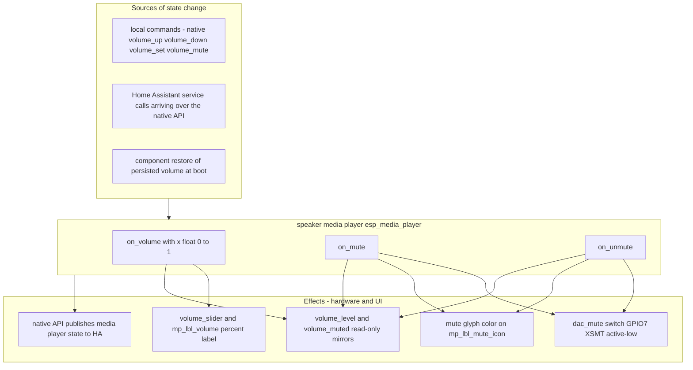

# Plan: Refactor media-player hooks — event-driven volume/mute via `on_volume` / `on_mute` / `on_unmute`

**Status:** Proposed — source of truth for the Code-mode implementation subtask.
**Date:** 2026-09-30
**Scope:** software-only refactor of the volume/mute control path in three packages ([`packages/esp-web-radio-audio.yaml`](packages/esp-web-radio-audio.yaml), [`packages/esp-web-radio-page_now_playing.yaml`](packages/esp-web-radio-page_now_playing.yaml), [`packages/esp-web-radio-homeassistant.yaml`](packages/esp-web-radio-homeassistant.yaml)) plus a one-line addition to `on_boot` in [`esp-web-radio.yaml`](esp-web-radio.yaml:20). No hardware, no HA-side, no layout/geometry changes; no new YAML files; no new top-level keys.
**Constraint:** there is **no local `esphome` installation**. Validation is limited to `python tests/yaml_syntax_check.py`, grep cross-reference review, and manual review of the merged model. **Never run any `esphome` CLI command.** Three compile-risk areas exist (native `media_player.volume_mute` action schema, the boot-time volume getter on the speaker component, `volume_increment` option) — each is flagged inline with its fallback, to be resolved against the installed ESPHome docs/source at build time (same pattern as the build-fix round in [`plans/improvements-4-6.md`](plans/improvements-4-6.md:120)).

This plan migrates the volume/mute control path from the command-centric `volume_set` "single source of truth" design to an **event-driven design** anchored on the speaker media player's documented triggers:

| Trigger | Semantics (documented speaker-platform page + this project's own commented snippet at [`packages/esp-web-radio-audio.yaml`](packages/esp-web-radio-audio.yaml:157)) |
|---|---|
| `on_volume` | fires whenever the component's volume changes; the new volume is passed in `x` as `float` 0..1 (`value: !lambda 'return (int)(x * 100.0f);'`) |
| `on_mute` | fires when the component becomes muted (payload-free) |
| `on_unmute` | fires when the component becomes unmuted (payload-free) |



---

## Context recap (from the current code)

- [`packages/esp-web-radio-page_now_playing.yaml`](packages/esp-web-radio-page_now_playing.yaml:46) owns the device-side volume globals: `volume_level` (float), `volume_muted` (bool), `volume_before_mute` (float), plus loop-guard `volume_last_pushed` (float) and `volume_mute_last_pushed` (bool).
- The `volume_set` script ([`packages/esp-web-radio-page_now_playing.yaml`](packages/esp-web-radio-page_now_playing.yaml:77), `mode: restart`) is today's single source of truth: applies native `media_player.volume_set`, mirrors `dac_mute` from `volume_muted`, syncs `volume_slider` + `mp_lbl_volume`, recolors `mp_lbl_mute_icon`, and — while `ha_connected` — pushes `media_player.volume_set` / `media_player.volume_mute` to HA via `homeassistant.action`, guarded by the last-pushed globals.
- `toggle_mute` ([`packages/esp-web-radio-page_now_playing.yaml`](packages/esp-web-radio-page_now_playing.yaml:152)) implements mute in software: save `volume_before_mute`, apply volume 0, restore on unmute. −/+ buttons step `volume_level` ±5 % in lambdas ([line 426](packages/esp-web-radio-page_now_playing.yaml:426), [line 466](packages/esp-web-radio-page_now_playing.yaml:466)); the popup slider `on_release` writes `volume_level = x / 100.0f` ([line 506](packages/esp-web-radio-page_now_playing.yaml:506)). `show_volume_popup` (5 s auto-hide, `mode: restart`) stays as-is.
- Receive path in [`packages/esp-web-radio-homeassistant.yaml`](packages/esp-web-radio-homeassistant.yaml:326): `player_volume` (attribute `volume_level`) and `player_muted` (attribute `is_volume_muted`) homeassistant sensors pull HA state into the globals/popup/DAC/glyph and adopt echoed values into the last-pushed guards (this adoption is what prevents feedback loops today).
- [`packages/esp-web-radio-audio.yaml`](packages/esp-web-radio-audio.yaml:81) defines `media_player` (platform `speaker`, id `esp_media_player`) with `on_play`/`on_pause`/`on_idle` already driving UI, and a **commented-out** `on_mute`/`on_unmute`/`on_volume` block (lines 143–160) showing the originally intended event-driven design. `dac_mute` switch (GPIO7, inverted, `restore_mode: ALWAYS_OFF`) is declared at [line 62](packages/esp-web-radio-audio.yaml:62).
- `ha_connected` is declared in [`packages/esp-web-radio-homeassistant.yaml`](packages/esp-web-radio-homeassistant.yaml:445) and set by `api.on_client_connected/disconnected` in [`packages/esp-web-radio-lvgl_ui.yaml`](packages/esp-web-radio-lvgl_ui.yaml:339).

---

## Design overview (decisions)

The refactor has one idea: **the component itself is the single source of truth for volume and mute**; the triggers are pure *reactions* (UI/hardware sync), and the native actions are pure *commands* with no UI or HA side-effects. Key decisions:

- **D1 — HA push strategy (hybrid).** *Volume:* delete the `homeassistant.action media_player.volume_set` push entirely — the native `media_player.volume_set/up/down` action changes the device's own entity state, which the native API publishes to connected clients automatically (the same mechanism that already carries play state and every `media_*` attribute to HA today; HA never needs a service call to learn the volume). *Mute:* keep the guarded `homeassistant.action media_player.volume_mute` push inside `on_mute`/`on_unmute` behind the existing `volume_mute_last_pushed` guard, because this project never exercised native mute before (mute was emulated), so device→HA publication of `is_volume_muted` is the one unproven direction. If on-device testing shows the attribute auto-mirrors, delete the mute push + guard too (full cleanup, see [Decision D1-B](#d1-b--fallback--keep-the-push-machinery)).
- **D2 — Mute semantics become native.** `media_player.volume_mute` sets the component's mute flag **without touching its volume**. This eliminates software mute entirely: `volume_before_mute` is deleted, and "unmute restores the remembered volume" becomes automatic (the volume never changed).
- **D3 — Globals.** Keep `volume_level` and `volume_muted` as **read-only mirrors** updated by the triggers (cheap; useful for the mute-button toggle decision, DBG logging, and the roadmap "startup volume level" settings item). Delete `volume_before_mute` and `volume_last_pushed`. Keep `volume_mute_last_pushed` (D1).
- **D4 — Home Assistant sensors removed.** `player_volume` and `player_muted` are deleted. HA-originated changes arrive at the device via the native API entity commands, which update the component and **fire the same triggers** — so `on_volume`/`on_mute`/`on_unmute` are source-agnostic and the explicit pull mirrors become dead weight.
- **D5 — Commands simplify.** −/+ use native `media_player.volume_up` / `media_player.volume_down` (platform `volume_increment`, default 5 %, made explicit); mute button uses native `media_player.volume_mute`; slider release uses native `media_player.volume_set` with `x / 100.0f`. To preserve today's UX, **− / + / slider-release unmute first** if currently muted, then step/set. `show_volume_popup` stays in the command handlers only (HA-originated changes must not pop the popup).
- **D6 — Boot/restore.** A small `sync_volume_ui` script reads the component's restored volume once in `on_boot` and pushes it into the mirror/slider/label. `on_volume` cannot be relied on at boot: restoring a persisted value is not a *change*, so the trigger may never fire.
- **D7 — Wifi-only mode.** The triggers never check `ha_connected`; the commands are native actions. Wifi-only is therefore just the same code with no push branch — nothing special to implement.

---

## What moves into each trigger

### `on_volume` (new, in [`packages/esp-web-radio-audio.yaml`](packages/esp-web-radio-audio.yaml:157) replacing the commented snippet)

1. Mirror `x` into `id(volume_level)` (read-only consumer mirror, D3).
2. `lvgl.slider.update: volume_slider` → `(int)(x * 100.0f)`.
3. `lvgl.label.update: mp_lbl_volume` → `%d%%` text from `(int)(x * 100.0f)`.
4. **No** `homeassistant.action` (D1 — the native state publication covers HA; an explicit push here would be the exact echo-loop path we are removing).

```yaml
    # Event-driven volume: fires for EVERY volume change regardless of source
    # (local commands, HA service calls via the native API). `x` = new volume
    # as float 0..1. Single universal sync point for the popup slider + label.
    on_volume:
      - lambda: 'id(volume_level) = x;'
      - lvgl.slider.update:
          id: volume_slider
          value: !lambda 'return (int)(x * 100.0f);'
      - lvgl.label.update:
          id: mp_lbl_volume
          text: !lambda |-
            int v = (int)(x * 100.0f);
            char buf[8];
            snprintf(buf, sizeof(buf), "%d%%", v);
            return buf;
```

> `on_volume` deliberately does **not** call `show_volume_popup` — the popup is a response to a local touch, not to state changes (D5).

### `on_mute` (new)

1. `id(volume_muted) = true` (mirror, D3).
2. `switch.turn_on: dac_mute` — PCM5102 XSMT, active-low: ON → LOW → hard-muted (moves here from `volume_set`; NOTE 1 is satisfied natively now).
3. Recolor `mp_lbl_mute_icon` → `${color_accent}` (orange) via `lv_obj_set_style_text_color` (same lambda shape as today's [`volume_set`](packages/esp-web-radio-page_now_playing.yaml:93)).
4. Guarded HA push (D1): `if ha_connected && !id(volume_mute_last_pushed)` → `homeassistant.action media_player.volume_mute { is_volume_muted: true }` → `id(volume_mute_last_pushed) = true`.

```yaml
    on_mute:
      - lambda: 'id(volume_muted) = true;'
      - switch.turn_on: dac_mute          # XSMT active-low: ON -> LOW -> DAC muted
      - lambda: 'lv_obj_set_style_text_color(id(mp_lbl_mute_icon), lv_color_hex(${color_accent}), 0);'
      - if:
          condition:
            lambda: 'return id(ha_connected) && !id(volume_mute_last_pushed);'
          then:
            - homeassistant.action:
                action: media_player.volume_mute
                data:
                  entity_id: media_player.esp_media_player
                  is_volume_muted: "true"
            - lambda: 'id(volume_mute_last_pushed) = true;'
```

### `on_unmute` (new)

Mirror of `on_mute`: `volume_muted = false`, `switch.turn_off: dac_mute`, glyph → `${color_text_muted}` (gray), guarded push `is_volume_muted: "false"` → `volume_mute_last_pushed = false`.

> **Edge case covered for free (D2):** native mute keeps the volume untouched, so `on_unmute` needs no `volume_before_mute` restore logic — the exact pre-mute volume is already there. Muting at volume 0 also needs no special handling (unmute returns to 0).

---

## Command simplification ([`packages/esp-web-radio-page_now_playing.yaml`](packages/esp-web-radio-page_now_playing.yaml))

| Command | Before (command-centric) | After (event-driven) |
|---|---|---|
| `mp_btn_vol_down` (line 416) | lambda `-0.05`, `volume_set`, popup | if muted → unmute first; `media_player.volume_down`; `show_volume_popup` |
| `mp_btn_vol_up` (line 457) | lambda `+0.05`, `volume_set`, popup | if muted → unmute first; `media_player.volume_up`; `show_volume_popup` |
| `mp_btn_mute` (line 440) | `script.execute: toggle_mute` | inline conditional `media_player.volume_mute` (ON if `volume_muted` false, else OFF) |
| `volume_slider.on_release` (line 506) | lambda `volume_level = x/100`, `volume_set`, popup | if `x > 0 && muted` → unmute; `media_player.volume_set { volume: x / 100.0f }`; `show_volume_popup` |

```yaml
# mute button (on_press) — schema of media_player.volume_mute is a build-time
# check item (state: ON/OFF vs muted: true/false per installed ESPHome).
- if:
    condition:
      lambda: 'return id(volume_muted);'
    then:
      - media_player.volume_mute:
          id: esp_media_player
          state: OFF
    else:
      - media_player.volume_mute:
          id: esp_media_player
          state: ON
```

```yaml
# slider (on_release)
- if:
    condition:
      lambda: 'return x > 0 && id(volume_muted);'
    then:
      - media_player.volume_mute:
          id: esp_media_player
          state: OFF
- media_player.volume_set:
    id: esp_media_player
    volume: !lambda 'return x / 100.0f;'
- script.execute: show_volume_popup
```

Notes:

- Unmute-before-step preserves the current UX ("pressing past 0 also clears the muted state") without touching `volume_level` directly.
- `media_player.volume_up`/`volume_down` step by the platform's `volume_increment` — add `volume_increment: 0.05` explicitly to the media_player in Step 1 (matches the documented 5 % default; self-documenting).
- Every reaction (slider, label, glyph, DAC, HA) now happens through the triggers; the command handlers contain **no UI or HA logic at all**.
- Deleted after this step: `volume_set` script, `toggle_mute` script, globals `volume_before_mute`, `volume_last_pushed`. `show_volume_popup` and `sync_volume_ui` remain scripts.

---

## Globals — delete vs keep

| Global | Type | Disposition | Reason |
|---|---|---|---|
| `volume_level` | float | **keep as read-only mirror** | updated by `on_volume`; consumer for future settings page ("startup volume"), DBG logs; no longer read by any command |
| `volume_muted` | bool | **keep as read-only mirror** | updated by `on_mute`/`on_unmute`; read by the mute button toggle decision |
| `volume_before_mute` | float | **delete** | native mute preserves volume (D2); software-mute machinery gone |
| `volume_last_pushed` | float | **delete** | no volume push exists anymore (D1); echo-loop path removed |
| `volume_mute_last_pushed` | bool | **keep** | guards the retained mute push (D1); self-heals via the push-then-set sequence (see Loop protection) |

All five currently declare `restore_value: no`; the two kept mirrors keep that. Boot truth comes from the component (D6), not from restored globals.

---

## Home Assistant sensors — `player_volume` / `player_muted` (point 4)

**They are removed.** Reasoning:

1. HA-originated volume/mute changes reach the device through the native API entity-command path (the same path HA uses to control any ESPHome media player from its dashboard/automations). The device component applies the change and **fires `on_volume` / `on_mute` / `on_unmute`** — exactly the triggers we now react to. There is no pull mirror needed.
2. Device-originated changes fire the same triggers locally *and* are published to HA by the API subscription, so HA's entity attributes stay correct without `homeassistant.action` for volume.
3. Deleting the sensors also removes the last writers of `volume_last_pushed`/`volume_before_mute` (both deleted) and their echo-adoption role — which is no longer needed because the loop path itself is gone (see next section).

**Contingency (documented in Risks):** if on-device testing shows HA-originated changes do *not* reach the triggers on the installed ESPHome version, reinstate `player_volume`/`player_muted` as receive-only mirrors (today's exact pattern) on top of the triggers — the triggers remain authoritative for local commands.

---

## Loop protection strategy (point 5)

- **Volume: no loop is possible anymore.** There is no `homeassistant.action` push in `on_volume` (D1). HA-originated change → trigger → UI update only. Device-originated change → trigger → UI update + device publishes identical value to HA → HA state is unchanged → no new event; even if HA echoed, the device already holds that value and `on_volume` does not re-fire for an unchanged volume. `volume_last_pushed` deleted.
- **Mute: single guard, self-healing.** `on_mute`/`on_unmute` push only when `id(volume_mute_last_pushed)` differs from the new state, then immediately set it. The former echo-adoption trick (via `player_muted`) is gone, so the first mute/unmute after boot always pushes once even if the transition originated in HA (idempotent `volume_mute` service call — HA is already in that state → no state change → no echo; and if it does echo, the guard is already latched → skip). Converges after at most one redundant, harmless push.
- **Keep it simple:** the guard lives in exactly two places (`on_mute`, `on_unmute`); both are documented with a short comment referencing this section. Nothing else in the config pushes volume/mute state to HA.

---

## Boot/restore (point 6)

The speaker component persists its volume in flash and restores it during setup — before `on_boot` runs. `on_volume` will not fire for a mere restore (no *change*), so the UI would otherwise show the 50 % default until the first volume event (a real wifi-only desync that exists today).

Add `sync_volume_ui` to [`packages/esp-web-radio-page_now_playing.yaml`](packages/esp-web-radio-page_now_playing.yaml:72) (next to `show_volume_popup`):

```yaml
  # Boot/restore: read the volume the speaker component restored from flash and
  # push it into the mirror + popup so the screen matches reality immediately.
  # on_volume cannot be relied on at boot (restoring is not a change).
  - id: sync_volume_ui
    then:
      - lambda: 'id(volume_level) = id(esp_media_player).volume;'   # getter name: verify (.volume vs .get_volume())
      - lvgl.slider.update:
          id: volume_slider
          value: !lambda 'return (int)(id(volume_level) * 100.0f);'
      - lvgl.label.update:
          id: mp_lbl_volume
          text: !lambda |-
            int v = (int)(id(volume_level) * 100.0f);
            char buf[8];
            snprintf(buf, sizeof(buf), "%d%%", v);
            return buf;
```

Append `- script.execute: sync_volume_ui` to `on_boot` in [`esp-web-radio.yaml`](esp-web-radio.yaml:20) after `refresh_stations`.

Boot mute state: the component starts unmuted and `dac_mute` has `restore_mode: ALWAYS_OFF`, so the DAC starts unmuted and the mirror `volume_muted=false` (initial value) and the gray glyph (YAML default) are already consistent. Nothing extra needed; a reboot while muted is expected to come back unmuted at the persisted volume.

---

## Wifi-only mode (point 7)

- Triggers contain no `ha_connected` branch except the optional mute push, which is inert offline (`ha_connected == false`). DAC, glyph, slider, and label react identically in every mode.
- Commands are native actions — they work with no HA at all (this was already true for `volume_set`; now it is true for mute and stepping too).
- Boot sync works offline (reads the component, not HA).
- HA reconnect: the device publishes its current state to the newly connected client, so HA adopts the device's volume automatically; the retained mute push covers the (pre-existing, unchanged) "muted while offline then reconnect" staleness for `is_volume_muted` — same limitation as today, optionally improved later by re-pushing on `on_client_connected` (out of scope).

---

## Static-layout contract (point 8)

Untouched: all widget ids (`volume_popup`, `volume_slider`, `mp_lbl_volume`, `mp_lbl_mute_icon`, `mp_controls` children) and every x/y/width/height on the page. This refactor edits only handler bodies (`on_press`/`on_release`), script definitions, globals, media_player triggers, and sensor definitions — zero geometry changes. `show_volume_popup` keeps its 5 s restart behavior.

---

## Edge cases (point 9)

| Case | Behavior |
|---|---|
| Mute while volume is already 0 | Native mute at any volume; DAC hard-mutes; unmute returns to volume 0 — no special handling (D2) |
| Unmute restoring the remembered volume | Automatic — native mute never changed the volume; `volume_before_mute` deleted |
| Announcement ducking | Announcements run on the separate `announcement_pipeline` through the mixer and do not change the media player's volume → `on_volume` should not fire for them. `dac_mute` mutes the whole DAC (both pipelines) — correct mute semantics. Verify on device; if an announcement ever does touch the media volume, the trigger picks it up harmlessly (idempotent UI update) |
| `on_volume` firing frequency | One fire per discrete step (0.05) for volume_up/down; one per slider release; one per HA-originated publish. LVGL updates are cheap/idempotent — no debounce needed. Rapid repeated presses yield one trigger per press, matching today's behavior |
| HA-originated changes during popup | Slider/label update live; the popup is not shown (it stays hidden until a local touch) |
| Boot while previously muted | Component restores volume, unmuted; DAC starts unmuted (`ALWAYS_OFF`); glyph gray — consistent |
| Offline mute then HA reconnect | `is_volume_muted` on HA may be stale until the next mute/unmute (pre-existing behavior); optionally addressed later via `on_client_connected` re-push — out of scope |

---

## File-by-file edit plan (ordered, config stays valid at each step)

### Step 0 — inventory & baseline

1. Grep inventory: record every reference to `volume_set`, `toggle_mute`, `player_volume`, `player_muted`, `volume_level`, `volume_muted`, `volume_before_mute`, `volume_last_pushed`, `volume_mute_last_pushed` across `packages/` and `esp-web-radio.yaml`.
2. Baseline: `python tests/yaml_syntax_check.py` — all listed files `OK`.

### Step 1 — [`packages/esp-web-radio-audio.yaml`](packages/esp-web-radio-audio.yaml:81): add the triggers (additive — nothing else changes yet)

- Add `volume_increment: 0.05` to the `media_player` block.
- Replace the commented block at lines 143–160 with the real `on_mute`, `on_unmute`, `on_volume` triggers per the snippets above (they reference only existing ids/globals: `volume_level`, `volume_muted`, `volume_mute_last_pushed`, `volume_slider`, `mp_lbl_volume`, `mp_lbl_mute_icon`, `dac_mute`, `ha_connected`).
- Config remains valid: `volume_set` still exists and still works; the triggers are additional *writers* that agree with it (today both write the same UI values).
- Validate: `python tests/yaml_syntax_check.py`.

> At this point the system is already event-driven in effect; the remaining steps remove the now-redundant command-centric machinery.

### Step 2 — [`packages/esp-web-radio-homeassistant.yaml`](packages/esp-web-radio-homeassistant.yaml:326): remove the pull mirrors

- Delete the `player_volume` sensor block (comment + definition, lines 326–351) and the `player_muted` sensor block (comment + definition, lines 353–387).
- This is safe before the next step: `player_muted`'s `script.execute: volume_set` reference disappears with it, and `volume_set` still exists until Step 3.
- Grep: no remaining references to `player_volume`/`player_muted` (a page-header comment reference is cleaned in Step 5).
- Validate: `python tests/yaml_syntax_check.py`.

### Step 3 — [`packages/esp-web-radio-page_now_playing.yaml`](packages/esp-web-radio-page_now_playing.yaml): commands simplify; delete the source-of-truth machinery

Do this as **one coherent edit** of the file (call sites first, deletions second — validated after):

1. Rewrite `mp_btn_vol_down`, `mp_btn_vol_up`, `mp_btn_mute`, `volume_slider.on_release` per the Command simplification table (native actions; unmute-first where applicable; `show_volume_popup` retained in all four).
2. Delete the `volume_set` script (lines 77–147) and the `toggle_mute` script (lines 152–165) — now unreferenced.
3. Delete globals `volume_before_mute` (line 55) and `volume_last_pushed` (line 63); keep `volume_level`, `volume_muted`, `volume_mute_last_pushed` (update comments to "read-only mirrors" / "mute push guard").
4. Add the `sync_volume_ui` script next to `show_volume_popup`.
5. Rewrite the header comment block (lines 28–45) and the bindings note (line 18) to describe the event-driven model (`on_volume`/`on_mute`/`on_unmute` as the single sync path; no more `player_volume` sensor row).
- Validate: `python tests/yaml_syntax_check.py`; grep confirms `volume_set`/`toggle_mute`/`volume_before_mute`/`volume_last_pushed` have zero references.

### Step 4 — [`esp-web-radio.yaml`](esp-web-radio.yaml:20): boot sync

- Append `- script.execute: sync_volume_ui` to `on_boot` (after `refresh_stations`).
- Validate: `python tests/yaml_syntax_check.py`.

### Step 5 — docs cleanup

- [`README.md`](README.md:294): bindings table rows for `volume_slider` / `mp_btn_mute` — point at native actions + triggers instead of `media_player.volume_mute`/`volume_set` "UI → HA" rows; project-structure bullet for `esp-web-radio-homeassistant.yaml` (drop "volume" from its sensor list); optionally a short paragraph describing the event-driven volume/mute model.
- [`TODO.md`](TODO.md:1): optional Completed entry documenting the refactor (no open TODO item maps to it).
- Grep README for stale `player_volume`/`player_muted` mentions and update.

### Step 6 — final validation

1. `python tests/yaml_syntax_check.py` — all listed files `OK` (no new files, so the checked-file list is unchanged).
2. Grep cross-references:
   - Zero references to `volume_set`, `toggle_mute`, `player_volume`, `player_muted`, `volume_before_mute`, `volume_last_pushed` (comments included — the plan's target is none).
   - `volume_mute_last_pushed` appears exactly: global declaration + `on_mute` + `on_unmute`.
   - Widget ids referenced by the triggers exist exactly once: `volume_slider`, `mp_lbl_volume`, `mp_lbl_mute_icon`.
   - `sync_volume_ui` defined once (page_now_playing.yaml) and executed once (`on_boot`).
   - `media_player.volume_mute` / `volume_up` / `volume_down` / `volume_set` targets resolve to `esp_media_player` only.
   - No duplicate ids; no new top-level keys.
3. Manual review of the merged model: no geometry changes on `page_now_playing`; media_player gains 3 triggers + `volume_increment`; homeassistant package loses 2 sensors; scripts reduced.

---

## Validation (without local esphome)

Covered by Steps 0–6 above: `python tests/yaml_syntax_check.py` at every step, grep cross-reference checks, and merged-model review. Hardware verification is deferred to the on-device checklist below (per plan conventions).

## On-device test checklist (for the build host / flashed device)

| # | Scenario | Expected |
|---|---|---|
| 1 | Boot (wifi-only) | slider/label show the persisted volume, not 50 % |
| 2 | +/− presses | ±5 % steps, popup shows with 5 s auto-hide; slider/label follow |
| 3 | Mute button | orange glyph, DAC silent (XSMT LOW); unmute → gray glyph, audio returns at the **exact** previous volume |
| 4 | Online, device side | HA dashboard's `volume_level` tracks device changes; `is_volume_muted` toggles (proves D1 mute push / publication) |
| 5 | Online, HA side | changing volume/mute from HA (dashboard/automation) updates device slider/label/DAC/glyph; no popup pops; HA state does not flap (no loop) |
| 6 | Volume 0 edge | drag slider to 0 → no mute state change (mute ≠ 0); mute at 0 → unmute returns to 0 |
| 7 | Rapid presses | steady 5 % steps, no stutter, no repeated HA pushes beyond transitions |
| 8 | Announcement (TTS) | plays at media volume; mute during announcement hard-mutes both pipelines; no spurious `on_volume` churn in logs |
| 9 | WiFi drop / HA disconnect | all controls keep working (native actions); no log errors |
| 10 | Log inspection | `on_mute`/`on_unmute`/`on_volume` fire once per transition; no repeating push/echo pattern |

If scenario 4/5 fails for volume or mute, apply the corresponding fallback from Risks.

## Risks

- **`media_player.volume_mute` action schema** — spellings vary by ESPHome version (`state: ON/OFF` vs `muted: true/false` vs a bare toggle). Verify against the installed docs at build time (same treatment as the `media_player.play_media` risk in [`plans/improvements-4-6.md`](plans/improvements-4-6.md:278)). Fallback: implement mute via a tiny script calling `media_player.volume_set` + `dac_mute` (today's emulation) only if no native mute action exists — but that contradicts the documented `on_mute`/`on_unmute` triggers, so it is unlikely.
- **Boot-time volume getter** — `id(esp_media_player).volume` (or `.get_volume()`) must compile on the installed version. Fallback: skip the read (accept 50 % display until the first volume event) or warm the mirror from the `player_volume` sensor in HA mode only.
- **`volume_increment` option** — expected on the speaker platform (documented 5 % default); explicit `0.05` is belt-and-suspenders. If the option does not exist, drop it and rely on the default.
- **HA-originated changes reaching the device triggers** — architectural certainty (native API entity commands), but unproven locally. Fallback: reinstate `player_volume`/`player_muted` as receive-only mirrors.
- **`is_volume_muted` device→HA publication** — the one direction never exercised today; mitigated by keeping the guarded mute push (D1). If testing proves auto-mirroring, delete the push + `volume_mute_last_pushed` (full cleanup).
- **Stale HA mute after offline mute + reconnect** — pre-existing limitation, unchanged; optional `on_client_connected` re-push noted as a possible future item.

## Decisions (review points)

1. **D1 / D1-B** — volume push deleted; mute push retained behind `volume_mute_last_pushed` with documented fallback to full removal after on-device verification. *Alternative:* keep both pushes (minimal behavioral delta vs today, more machinery); not recommended — it retains the exact echo-loop pattern this refactor exists to eliminate.
2. **D2** — native mute semantics replace software mute; `volume_before_mute` deleted; unmute-restore becomes free.
3. **D3** — `volume_level`/`volume_muted` remain read-only mirrors; everything else in the volume state cluster is deleted or repurposed.
4. **D4** — pull sensors removed; triggers are source-agnostic (fallback documented).
5. **D5** — commands carry zero UI/HA side-effects; unmute-first preserved; popup stays touch-driven.
6. **D6** — `sync_volume_ui` at boot closes today's boot-time desync (component persistence vs 50 % default mirrors).
7. **Naming** — `plans/refactor-media-player-hooks.md` follows the repo's lowercase-kebab convention (like [`plans/improvements-4-6.md`](plans/improvements-4-6.md), [`plans/completed_no-ha-time-sync.md`](plans/completed_no-ha-time-sync.md)); implementation is expected to run through Code mode against this plan as source of truth.